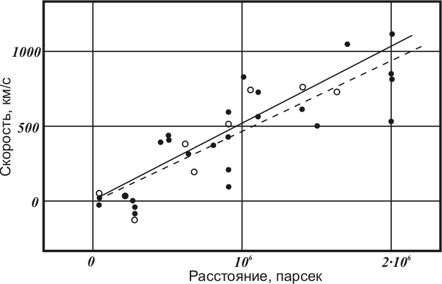

## 1. Введение

Мы будем рассматривать главным образом эволюцию вселенной и то, как меняются в следствии её расширения некоторые космологические и физические параметры, описывающие её.

При этом важно понимать характер расширения вселенной. Не объекты улетают все друг от друга, а растягивается само пространство. Например, представьте, что вы посадили несколько муравьёв на воздушный шарик и начали его надувать. Муравьи никуда не ползут, но при этом все удаляются друг от друга, потому что их пространство (поверхность шарика) растягивается. Важно заметить, что сами муравьи не увеличиваются. Примерно такой же характер и носит расширение вселенной, только оно происходит не в двумерном пространстве, а в трёхмерном. При этом силы притяжения внутри объекта также препятствуют его расширению (как и с муравьями).

При рассмотрении Вселенной в космологии обычно принимают космологический принцип: на достаточно больших масштабах Вселенная считается однородной и изотропной. Это означает, что её свойства в среднем не зависят от положения и направления наблюдения.

Напомним определение космологического красного смещения:

::: {.definition title="Космологическое красное смещение"}
Космологическое красное смещение – эффект увеличения длин волн фотонов в следствие расширения вселенной. Механизм его возникновения в достаточно прост: пока фотон летит вселенная расширяется, и вместе с ней растягивается и длина волны фотона.
:::

Для количественного описания данного эффекта вводится величина красного смещения (или просто красное смещение) $z$, равное отношению изменения длины волны к изначальной длине волны:

$$
z = \frac{\Delta \lambda}{\lambda_0} = \frac{\lambda_1 - \lambda_0}{\lambda_0}
$$

Здесь $\lambda_1$ – длина волны принимаемого фотона, $\lambda_0$ – длина волны фотона в момент излучения.

Теперь введём понятие масштабного фактора.

::: {.definition title="Масштабный фактор"}
Масштабный фактор – величина, характеризующая относительный масштаб нашей вселенной в некоторый момент. Например, допустим, что в момент $t_1$ некоторая область пространства имела длину $r_1$, а масштабный фактор составлял $a_1$. В другой момент $t_2$ та же область имела длину уже $r_2$, а масштабный фактор составлял уже $a_2$. Тогда, верно:

$$
\frac{r_1}{r_2} = \frac{a_1}{a_2}
$$
:::

Как можно заметить, такое определение не даёт однозначного сопоставления момента времени и соответствующего масштабного фактора. Для этого нужен какой-то нормировочный момент времени. Чаще всего (но не всегда) за $a_0 = 1$ принимают нынешний момент. Тогда в прошлом масштабный фактор меньше $1$, потому что вселенная тогда была меньше, а в будущем больше $1$.

Если в какой-то момент масштабный фактор составлял, например, $0.5$ это значит, что вселенная была в $2$ раза меньше. Масштабный фактор (и другие величины) в нынешний момент (если не сказано иного) будем обозначать $a_0$.

Теперь найдём связь между масштабным фактором вселенной в момент излучения фотона ($a_1$), масштабным фактором сейчас ($a_0$) и красным смещением фотона ($z$). Зная, что длина волны фотона растягивается как раз из-за расширения вселенной по определению масштабного фактора получим:

$$
\frac{\lambda_1}{\lambda_0} = \frac{a_0}{a_1}
$$

Приняв $a_0 = 1$, переобозначив $a = a_1$ и немного преобразовав, получим:

::: {.formula-box caption="Связь красного смещения и масштабного фактора"}
$$
z = \frac{\lambda_1}{\lambda_0} - 1 = \frac{1}{a} - 1
$$

$$
a = \frac{1}{1 + z}
$$
:::

Теперь перейдём к постоянной Хаббла.

::: {.definition title="Постоянная Хаббла"}
Постоянная Хаббла – относительное изменение масштабного фактора в единицу времени. Заметим, что это то же самое, что и относительное изменение расстояния (длины) в единицу времени.

$$
H = \frac{d a}{a , d t}
= \frac{\dot{a}}{a}
= \frac{\dot{r}}{r}
= \frac{v}{r}
\left[
\frac{\text{км}}{\text{с} \cdot \text{Мпк}}
\approx 3.1 \cdot 10^{19} \frac{1}{\text{с}}
\right]
\label{habbl}
$$
:::

Здесь $v$ стоит понимать как скорость расширения какой-то области пространства. Оказывается, что $H$ одинакова во всей вселенной для фиксированного момента времени, но при этом меняется с течением времени (в масштабах нашей жизни мы считаем её неизменной). Значение постоянной Хаббла для данного момента $H_0$ мы знаем лишь с некоторой точностью (разные оценки отличаются на $5 - 10$ %). Мы будем считать её равной:

$$
H_0 \approx 68
\left[
\frac{\text{км}}{\text{с} \cdot \text{Мпк}}
\right]
\approx 2.2 \cdot 10^{-18}
\left[
\frac{1}{\text{с}}
\right]
$$

## 2. Закон Хаббла - Леметра

В $1927$ Леметром, а потом и в $1929$ году Хабблом (независимо друг от друга) был открыт закон Хаббла - Леметра. В формулировке Хаббла он выглядит следующим образом:

::: {.law title="Закон Хаббла-Леметра"}
Скорость удаления галактик прямо пропорциональна расстоянию до них.

$$
v = H_0 \cdot r
$$
:::

Здесь $v$ – скорость удаления галактик от Земли, $r$ – расстояние до этих галактик, $H_0$ – постоянная. Закон был открыт как эмпирический факт. Большую роль в открытии сыграли “стандартные свечи”, объекты с известной светимостью, или со светимостью, которую можно определить, например, цефеиды. Скорость галактик измеряли при помощи эффекта Допплера. На графике представлены данные, предоставленные Хабблом в его работе.

Как видно из графика, первоначальное значение постоянной Хаббла оценивалось примерно в $500 \frac{\text{км}}{\text{с} \cdot \text{Мпк}}$, что отличается на порядок от общепринятого сейчас значения. Также виден достаточно большой разброс точек относительно прямой. Это произошло в основном по двум причинам.

1. Все (или почти все) взятые в работе галактики принадлежат местной группе галактик, и их собственные скорости вносят достаточно большой вклад.
2. При подсчёте расстояния до галактик не было учтено (или учтено неверно) поглощение света.

Отсюда сразу понятно, что закон Хаббла плохо выполняется для расстояний, соответствующим местной группе галактик. Его стоит применять для расстояний, больших $5$ Мпк.

На самом деле, закон Хаббла напрямую следует из того определения, которое мы дали постоянной Хаббла (если принять на веру, что постоянная Хаббла – действительно одинакова везде в некоторый момент времени). По сути закон Хаббла доказывает, что условие равенства постоянной Хаббла во всей вселенной в некоторый момент времени выполняется (по крайней мере для всех областей пространства, на границе которых мы находимся). Таким образом, постоянная, найденная Хабблом ($H_0$) и постоянная Хаббла в нынешний момент из нашего определения – одна и та же величина.