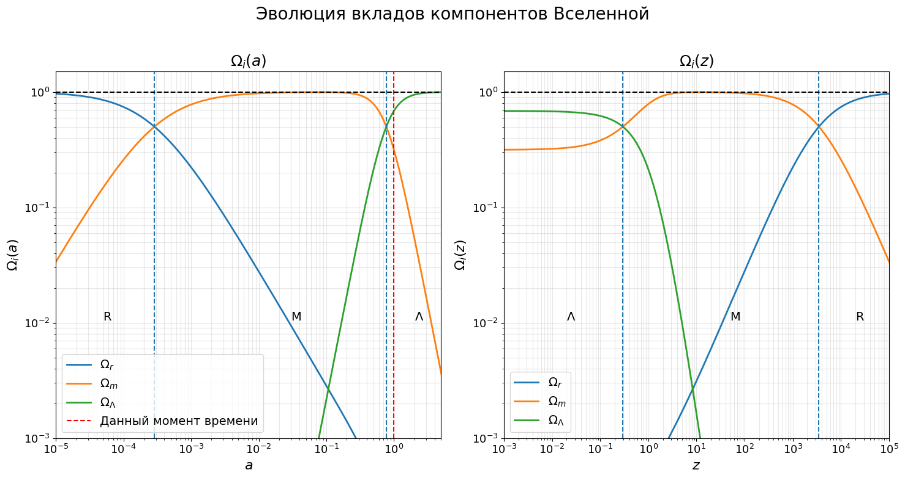

## 1. Эпохи доминирования

В данной главе мы будем работать в модели $\Lambda$-CDM, с добавлением излучения (вселенную будем считать плоской).

Для упрощения модели нам удобно разделить жизнь вселенной на эпохи доминирования различных её составляющих. Под этим термином бы будем понимать следующее определение:

::: {.definition title="Эпоха доминирования"}
Эпоха доминирования — период эволюции Вселенной, в течение которого один из её компонентов вносит наибольший вклад в плотность энергии, то есть его относительная плотность $\Omega_i$ превышает относительные плотности остальных компонентов.
:::

Уравнение Фридмана позволяет нам вычислить значения красных смещений, при которых сменялись эпохи доминирования.

Выразим значения $\Omega$ через $\Omega_0$ и масштабный фактор $a$:

$$
\Omega_m = \frac{\rho_m}{\rho_{\text{cr}}} = \frac{\rho_m}{\rho_{\text{cr0}}}\cdot\frac{\rho_{\text{cr0}}}{\rho_{\text{cr}}} = \Omega_{0m}\cdot a^{-3}\cdot\frac{\rho_{\text{cr0}}}{\rho_{\text{cr}}}
$$

Аналогично для остальных:

$$
\Omega_r = \Omega_{0r}\cdot a^{-4}\cdot\frac{\rho_{\text{cr0}}}{\rho_{\text{cr}}}
$$

$$
\Omega_\Lambda = \Omega_{0\Lambda}\cdot\frac{\rho_{\text{cr0}}}{\rho_{\text{cr}}}
$$

Отметим, что из уравнения Фридмана $\eqref{Fr_eq}$ (или $\eqref{Fr_eq_k}$) следует при уменьшении масштабного фактора постоянная Хаббла (а значит и критическая плотность) обязаны увеличиваться. Такой результат можно было ожидать, так как все плотности либо растут, либо остаются неизменными с уменьшением масштабного фактора.

Видим, что относительно друг друга при уменьшении масштабного фактора (удалении в прошлое) доля тёмной энергии уменьшается, доля материи и излучения увеличивается (по крайней мере в окрестности нынешнего момента времени). Из значений $\Omega_0$ видим, что сейчас доминирует тёмная энергия. При этом очевидно, что отношения $\Omega_\Lambda / \Omega_m$ и $\Omega_\Lambda / \Omega_r$ монотонно уменьшаются и стремятся к $0$ при устремлении масштабного фактора к $0$. Это значит что до эпохи доминирования тёмной энергии была хотя бы одна другая эпоха доминирования (материи и излучения), а других быть не могло. В то же время отношения $\Omega_r / \Omega_m$ и $\Omega_r / \Omega_\Lambda$ монотонно увеличиваются и стремятся к бесконечности при устремлении масштабного фактора к $0$, а значит в начале жизни нашей вселенной доминировало именно излучение.

На графиках изображены зависимости разных вкладов от масштабного фактора (первый график) и красного смещения (второй график), оси на обоих графиках -- логарифмические. Также на графиках пунктирными синими линиями обозначены переходы доминирований и подписаны сами эпохи (R - излучение, M - материя, $\Lambda$ - тёмная энергия).

Из уравнения Фридмана несложно получить масштабные факторы (и красные смещения), на которых вклады различных компонент были равны. Каждая из $\Omega$ пропорциональна множителю $\frac{\rho_{\text{cr0}}}{\rho_{\text{cr}}}$, поэтому при нахождении момента, когда вклады были равны он сократится.

Начнём с равенства вкладов материи и излучения:

$$
\Omega_r = \Omega_m ~~~ \Rightarrow ~~~ \Omega_{0r}\cdot a^{-4} = \Omega_{0m}\cdot a^{-3}
$$

$$
a_{m=r}
=
\frac{\Omega_{0r}}{\Omega_{0m}}
\approx 0.0003
$$

$$
z_{m=r}
=
\frac{1}{a_{m=r}}-1
\approx 3400
$$

Аналогично для вкладов материи и тёмной энергии:

$$
\Omega_m = \Omega_\Lambda ~~~ \Rightarrow ~~~ \Omega_{0m}\cdot a^{-3} = \Omega_{0\Lambda}
$$

$$
a_{\Lambda=m}
=
\left(
\frac{\Omega_{0m}}{\Omega_{0\Lambda}}
\right)^{1/3}
\approx 0.77
$$

$$
z_{\Lambda=m}
=
\frac{1}{a_{\Lambda=m}}-1
\approx 0.31
$$

Итого видим, что в молодой вселенной доминировало излучение (примерно до $z = 3400$), далее доминировала материя (до $z = 0.3$) и сейчас доминирует тёмная энергия.

::: note
Аналогично можно получить и масштабный фактор, на котором тёмная энергия начинает вносить больший вклад, по сравнению с излучением. Оказывается, что этот переход соответствует $z_{r = \Lambda} \approx 8.4$.
:::

## 2. Эволюция вселенной

Для описания эволюции и расширения вселенной необходимо знать зависимость масштабного фактора от времени. Однако в общем виде это сделать очень сложно. Поэтому будем выводить эти зависимости в модели, где одна из составляющих нашей вселенной доминирует. Здесь везде, как и раньше под индексом $0$ понимается момент, когда масштабный фактор равен $1$. 

При рассмотрении эпохи доминирования будем считать, что можно писать только выбранный компонент в уравнении Фридмана, при этом его $\Omega_0$ будет брать равной $1$, так как считаем что вселенная состоит именно из этого компонента.

### 2.1. Эпоха доминирования тёмной энергии

Начнём с доминирования тёмной энергии. Для получения зависимости масштабного фактора от времени распишем уравнение Фридмана (для энергии):

$$
H^2 = H_0^2\cdot\Omega_{0\Lambda}
$$

$$
\frac{d a}{a\cdot d t} = H_0
$$

Отметим, что значение $H_0$ при доминировании тёмной энергии постоянно.

Проинтегрируем от некоторого момента "b", который происходил (произойдёт) во время соответствующего доминирования. Зачастую удобно взять в качестве момента "b" начало доминирования.

$$
\int_{a_b}^{a(t)} \frac{d a}{a} = \int_{t_b}^{t} H_0\,d t
$$

$$
\ln\left(\frac{a(t)}{a_b}\right) = H_0\cdot(t-t_b)
$$

::: {.formula-box caption="Зависимость a(t) при доминировании тёмной энергии"}
$$
a(t) = a_b\cdot e^{H_0\cdot(t-t_b)} \sim e^{H_0 t}
$$
:::

Мы получили, что вселенная при доминировании тёмной энергии расширяется экспоненциально.

### 2.1. Эпоха доминирования материи

Теперь рассмотрим вселенную с доминированием материи. Аналогично распишем уравнение Фридмана:

$$
H^2 = H_0^2\cdot(\Omega_{0m}\cdot a^{-3})
$$

$$
\frac{d a}{a\cdot d t} = H_0\cdot(1\cdot a^{3/2})
$$

$$
\int_{a_b}^{a(t)} \sqrt{a}\,d a = \int_{t_b}^{t} H_0\cdot d t
$$

Здесь опять же под моментом подразумевается некий опорный момент, также принадлежащий эпохе доминирования. Отсюда получаем:

$$
\frac{2}{3}a(t)^{3/2} - a_1^{3/2} = H_0\cdot(t-t_1)
$$

::: {.formula-box caption="Зависимость a(t) при доминировании материи"}
$$
a(t) = \left(a_1^{3/2} + \frac{3}{2}\cdot H_0\cdot(t-t_1)\right)^{2/3} \sim t^{2/3}
$$
:::

Отдельно рассмотрим случай вселенной, которая всю жизнь находилась при доминировании материи (или заполненной только ею). Тогда в качестве момента $b$ можно выбрать момент рождения: $a_b = 0, t_b = 0$. Подставляя, имеем:

::: {.formula-box caption="Зависимость a(t) при доминировании материи, начиная с большого взрыва"}
$$
a(t) = \left(\frac{3H_0}{2}\cdot t\right)^{2/3}
$$
:::

Видим, что полученное соотношение эквивалентно тому, что мы получали ранее для вселенной, состоящей из холодной материи. Отдельно рассмотрим момент $a = a_0 = 1$. Тогда:

$$
\frac{3H_0}{2} \cdot t_0 = 1
$$

Отсюда получаем выражение для возраста вселенной в данный момент:

$$
T_0 = \frac{2}{3H_0}
$$

На самом деле в связи с тем, что "нулевой" момент времени не фиксирован и мы можем сами его выбрать это выражение можно записать и в более общем виде:

::: {.formula-box caption="Возраст вселенной с доминировании материи, начиная с большого взрыва"}
$$
T = \frac{2}{3H}
$$
:::

На самом деле для нашей вселенной эпоха доминирования излучения длилась настолько недолго, что при описании доминирования материи ей зачастую пренебрегают и считают, что материя доминировала изначально.

### 2.1. Эпоха доминирования излучения

Рассмотрим также вселенную с доминированием излучения. Аналогично предыдущим компонентам:

$$
H^2 = H_0^2\cdot(\Omega_{0r}\cdot a^{-4})
$$

$$
\frac{d a}{a\cdot d t} = H_0\cdot(1\cdot a^{2})
$$

$$
\int_{a_b}^{a(t)} a\,d a = \int_{t_b}^{t} H_0\cdot d t
$$

Откуда получаем:

$$
\frac{1}{2}\left(a(t)^2 - a_b^2\right) = H_0\cdot(t-t_b)
$$

::: {.formula-box caption="Зависимость a(t) при доминировании материи"}
$$
a(t) = \left(a_b^2 + 2\cdot H_0\cdot(t-t_b)\right)^{1/2} \sim t^{1/2}
$$
:::

Опять же, если доминирование излучения началось с рождения вселенной, можем взять $a_b = 0, t_b = 0$. Именно это, кстати говоря, соответствует нашей вселенной. Подставляя, получаем:

::: {.formula-box caption="Зависимость a(t) при доминировании излучения, начиная с большого взрыва"}
$$
a(t) = \left(2\cdot H_0\cdot t\right)^{1/2}
$$
:::

Аналогично эпохе доминирования материи можем рассмотреть $a_0 = 1$ и получить выражение для возраста вселенной в момент $a_0$. А в связи с тем, что выбор $a_0$ может быть произвольным имеем:

::: {.formula-box caption="Возраст вселенной с доминировании излучения, начиная с большого взрыва"}
$$
T = \frac{1}{2H}
$$
:::

На графиках ниже представлена зависимость масштабного фактора от времени(для логарифмической и линейной шкал времени). Пунктирными синими линями опять же обозначены моменты смены эпохи доминирования, а буквами подписаны эти эпохи (R - излучение, M - материя, $\Lambda$ - тёмная энергия).

.png)

На первом графике видно, что при доминировании излучения и материи в логарифмических осях зависимость становится линейной (при этом коэффициенты наклона отличается, для излучения $1/2$, для материи $2/3$). На втором графике видно, как в данных осях кривая зависимости $a(t)$ постепенно становится линейной. Это соответствует переходу от доминирования материи к доминированию тёмной энергии.

Рассматривая подробнее зависимости $a(t)$ для разных доминирований можно заметить, что время жизни вселенной по сути обратно пропорционально $H$. На самом деле это закономерно, потому что если присмотреться к величине $1/H$, то можно увидеть, что это по сути время, за которое вселенная бы расширилась до данного состояния, с нынешним темпом расширения.

::: note
Используя связь времени жизни вселенной и постоянной Хаббла можем оценить возраст вселенной в моменты, когда эпохи доминирования сменяли друг друга. Начнём с перехода от излучения к материи. От момента большого взрыва до этого перехода доминировало излучение, поэтому можем воспользоваться:

$$
T = \frac{1}{2H}
$$

Осталось только посчитать постоянную Хаббла для того момента. Мы знаем, что $a_{m=r} = 0.0003$. Подставляя в уравнение Фридмана получаем:

$$
H = H_0 \cdot \sqrt{\Omega_{m 0} a_{m=r}^{-3} + \Omega_{r 0} a_{m=r}^{-4} + \Omega_{\Lambda 0}} \approx 10^7 \frac{\text{км}}{\text{с}\cdot\text{Мпк}}
$$

Откуда:

$$
T_{m = r} \approx 50 \text{ тысяч лет}
$$

Теперь рассмотрим переход от доминирования материи к тёмной энергии. Понятно, что это происходило значительно после первого перехода, а значит этими $50$ тысячами лет можем пренебречь. Тогда:

$$
T = \frac{2}{3H}
$$

Опять же посчитаем $H$, считая $a_{\Lambda = m} = 0.77$. Подставляя в уравнение Фридмана имеем: 

$$
H = 79 \frac{\text{км}}{\text{с}\cdot\text{Мпк}}
$$

$$
T_{\Lambda = m} \approx 8 \text{ млрд. лет}
$$

Учитывая, что возраст вселенной равен примерно $13.6$ млрд. лет получаем, что последние примерно $5$ млрд. лет у нас была эпоха доминирования тёмной энергии.
:::

## 3. Использование полиномиального приближения для анализа a(t)

Продемонстрируем ещё один подход к определению зависимости $a(t)$. Вместо того, чтобы переходить к доминированию конкретного компонента попробуем их все (или почти все), рассматривая область вселенной, близкую к нам.

Так как мы будем рассматривать современную вселенную, можем сразу пренебречь вкладом излучения (так как он сейчас почти не влияет на динамику расширения). Также для простоты положим вселенную плоской. Тогда уравнение Фридмана имеет вид:

$$
H^2 = H_0^2 (\Omega_{\Lambda 0} + \Omega_{m 0} \cdot a^{-3})
$$

Приблизим зависимость $a(t)$ вблизи $a_0 = 1$:

$$
a(t) \approx 1 + \dot a \Delta t + \frac{1}{2} \ddot a \Delta t^2
$$

Первое слагаемое задаёт начальное значение масштабного фактора, второе описывает расширение Вселенной с постоянной скоростью и представляет собой линейную поправку к начальному значению, а третье учитывает постоянное ускорение расширения, то есть является линейной поправкой к скорости или, соответственно, квадратичной поправкой к масштабному фактору.. Понятно, что при малых $\Delta t$ каждый следующий одночлен будет вносить всё меньшее изменение. При желании можно разложить и дальше, но мы ограничимся разложением до второго порядка.

Найдём $\dot a, \ddot a$. Первая производная по времени выражается из определения постоянной Хаббла.

$$
H = \frac{\dot a}{a} ~~~ \Rightarrow ~~~ \dot a = H \cdot a
$$

Теперь распишем вторую производную:

$$
\ddot a = \frac{\dd{\dot a}}{\dd t} = \dot{(H \cdot a)}
$$

Распишем через уравнение Фридмана:

$$
\ddot a = H_0 \cdot \frac{\dd}{\dd t} \sqrt{\Omega_{\Lambda 0} \cdot a^2 + \Omega_{m 0} \cdot a^{-1}}
$$

$$
\ddot a = H_0 \cdot \frac{2 \Omega_{\Lambda 0} \cdot a - \Omega_{m 0} \cdot a^{-2}}{2 \sqrt{\Omega_{\Lambda 0}a^2 + \Omega_{m 0} \cdot a^{-1}}} \cdot \dot a
$$

Так как нас интересует зависимость $a(t)$ вблизи $a_0 = 1$ имеем:

$$
\dot a = H_0 \cdot a_0 = H_0
$$

Аналогично, подставляя $a = a_0 = 1$ и $\dot a = H_0$:

$$
\ddot a = H_0^2 \cdot \frac{2 \Omega_{\Lambda 0} - \Omega_{m 0}}{2}
$$

Итого, подставляя всё в изначальное выражение имеем:

::: {.formula-box caption="Приближение зависимости a(t) для современной вселенной"}
$$
a(t) \approx 1 + H_0 \Delta t + \frac{2 \Omega_{\Lambda 0} - \Omega_{m 0}}{4} H_0^2 \Delta t^2
$$
:::

На графике ниже представлены сравнение различных моделей. Синим обозначено реальная зависимость a(t), зелёным и чёрным обозначены a(t) в моделях с доминированием тёмной энергии и материи соответственно, а красными точками обозначено наше второе приближения.

Все модели были построены от данного момента времени, поэтому и все проходят через точку $t_0, a_0$.

.png)

Из графика видно, что полученное приближение очень неплохо аппроксимирует реальную зависимость на широком временном промежутке. Оно также оказывается лучше модельных приближений для различных доминирований в рассматриваемом на графике промежутке времени.

Такое приближение можно спокойно использовать для диапазона времён примерно с $5$ до $25$ млрд. лет с момента рождения вселенной (масштабный фактор примерно от $0.5$ до $2$), причём эти границы можно воспринимать как достаточно консервативные.
