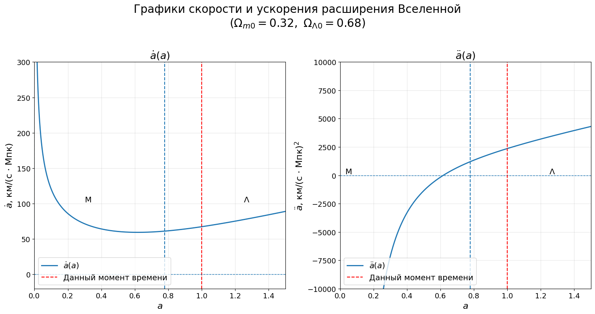
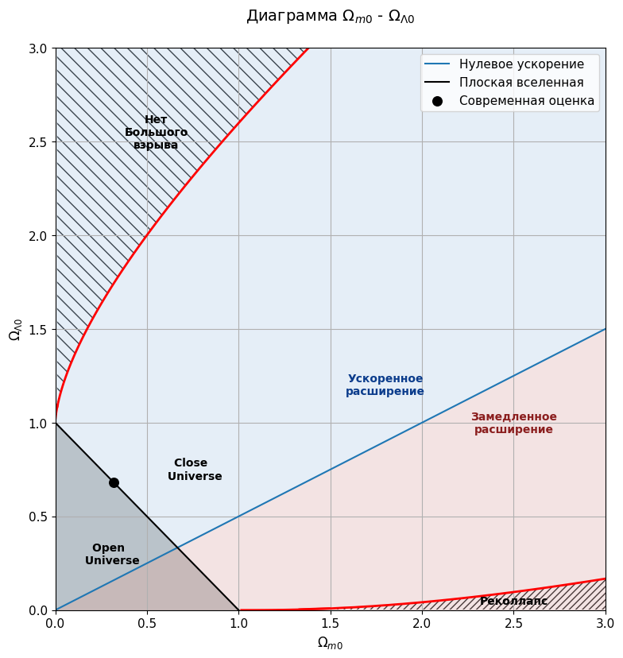

## 1. Введение

В данной главе будет считать, что вселенная состоит из материи, тёмной энергии и кривизны. Вкладом излучения для современной вселенной как правило можно пренебрегать.

В первой части рассмотрим некоторые следствия из уравнения Фридмана (для энергии), в том числе рассмотрим некоторые сценарии эволюции вселенной и условия, при которых они реализуются.

Также подробнее остановимся на неклассической тёмной энергии.

## 2. Скорость и ускорение расширения вселенной

Получим выражения для скорости и ускорения в произвольный момент времени. По определению постоянной Хаббла:

$$
H = \frac{\dot a}{a}
$$

Откуда, при подстановке в уравнение Фридмана $\eqref{Fr_eq_k}$ (без учёта излучения) получаем:

::: {.formula-box caption="Выражение для скорости расширения"}
$$
\dot a = H_0 \sqrt{\Omega_{m 0} \cdot a^{-1} + \Omega_{\Lambda 0} \cdot a^{2} + \Omega_{k 0}} = H \cdot a
\label{dot_a}
$$
:::

Физический смысл данного выражения просто: постоянная Хаббла по сути является скоростью роста единицы расстояния, поэтому при домножении её на масштабный фактор и получается скорость его роста.

Теперь перейдём к ускорению расширения:

$$
\ddot a = \frac{\dd{\dot a}}{\dd t} = H_0 \cdot \frac{2 \Omega_{\Lambda 0} \cdot a - \Omega_{m 0} \cdot a^{-2}}{2 \sqrt{\Omega_{\Lambda 0}a^2 + \Omega_{m 0} \cdot a^{-1} + \Omega_{k 0}}} \cdot \dot a
$$

Подставляя выражение для $\dot a$ получаем:

::: {.formula-box caption="Выражение для ускорения расширения"}
$$
\ddot a = H_0^2 \cdot \frac{2 \Omega_{\Lambda 0} \cdot a - \Omega_{m 0} \cdot a^{-2}}{2}
\label{ddot_a}
$$
:::

На графиках ниже представлены зависимости скорости и ускорения расширения для современной $\Lambda$-CDM модели.

Из графиков видим, что что изначально вселенная расширялась с отрицательным ускорением (так как зависимость $a(t)$ была степенной), а потом начала расширяться с положительным ускорением (экспоненциальная зависимость $a(t)$).

::: note

Несложно найти и масштабный фактор, на котором вселенная начала расширяться с ускорением. Для этого воспользуемся выражением для ускорения и приравняем его к $0$:

$$
\ddot a = H_0^2 \cdot \frac{2 \Omega_{\Lambda 0} \cdot a - \Omega_{m 0} \cdot a^{-2}}{2} = 0
$$

Отсюда имеем:

$$
2 \Omega_{\Lambda 0} \cdot a - \Omega_{m 0} \cdot a^{-2} = 0
$$

$$
\boxed{
a_с = \sqrt[3]{\frac{\Omega_{m 0}}{2 \Omega_{\Lambda 0}}} \approx 0.62
}
\label{a_c_cosm}
$$

Значение было получено опять же для $\Omega_{m 0} = 0.32, ~ \Omega_{\Lambda 0} = 0.68$. Именно эта точка соответствует на графиках минимуму первой производной и переходу через $0$ для второй.

Интересно, что такой переход (по сути от степенного расширения к экспоненциальному) произошёл значительно перед равенством вкладов. Иногда именно значение $a_c$ берётся в качестве границы перехода в эпоху тёмной энергии.
:::

## 3. Эволюция постоянной Хаббла

Ранее мы говорили о том, что значение постоянной Хаббла всю жизнь вселенной уменьшалось. Запишем уравнение Фридмана:

$$
H = H_0 \cdot \sqrt{\Omega_{m 0} \cdot a^{-3} + \Omega_{\Lambda 0} + \Omega_{k 0} \cdot a^{-2}}
$$

Видно, что при при масштабном факторе, стремящемся к $0$ постоянная Хаббла стремится к бесконечности, а далее при увеличении $a$ она постепенно спадает. Заметим, однако, что при ненулевом (и положительном) вкладе тёмной энергии её значение никогда не уходит в $0$.

Также отметим, что учёт излучения качественно не поменяет картину.

На графике ниже представлена зависимость постоянной Хаббла от масштабного фактора ($\Omega_{m 0} = 0.32, ~ \Omega_{\Lambda 0} = 0.68$):

.png)

Действительно, из графика видно, что при стремлении масштабного фактора (а значит и времени) к бесконечности значение постоянной Хаббла выходит на плато. Этого можно было ожидать, так как для вселенной состоящей из тёмной энергии постоянная Хаббла не меняется со временем.

::: note

Несложно показать, к какому значению стремится постоянная Хаббла. Записывая уравнение Фридмана и устремляя масштабный фактор к бесконечности имеем:

$$
H_{\infty} = H_0 \sqrt{\Omega_{\Lambda 0}}
$$

Для современных оценок имеем:

$$
H_{\infty} \approx 55.6 \text{ км/(с $\cdot$ Мпк)}
$$

:::

## 4. Пространство космологических параметров

Эволюция вселенной в классических моделях очень во многом определяется уравнение Фридмана (для энергии). И если $H_0$ по сути просто является нормировкой уравнения, то значения вкладов определяют по сути целые сценарии эволюции. 

При этом, как мы уже говорили ранее для современной (достаточно холодной) вселенной вкладом излучения можно пренебречь. В таком случае вклады материи и тёмной энергии будут полностью определять эволюцию вселенной. Действительно, пренебрегая излучением вклад кривизны может быть выражен так:

$$
\Omega_k = 1 - \Omega_m - \Omega_\Lambda
$$

И для данного момента времени:

$$
\Omega_{k 0} = 1 - \Omega_{m 0} - \Omega_{\Lambda 0}
$$

Для наглядного представления различных сценариев жизни и классификаций вселенных удобно построить диаграмму $\Omega_{m 0} - \Omega_{\Lambda 0}$ и уже на этой плоскости рассматривать различные области. Оговоримся, что будет рассматривать только случай положительный вкладов материи и тёмной энергии.

### 4.1. Классификация по кривизне пространства.

Определим области на плоскости, где вселенная является открытой, закрытой и плоской. Начнём с открытой вселенной. Для неё кривизна должна быть отрицательной, а соответственно вклад кривизны положительным:

$$
\Omega_{k 0} = 1 - \Omega_{m 0} - \Omega_{\Lambda 0} > 0
$$

$$
\Omega_{m 0} + \Omega_{\Lambda 0} < 1
$$

Аналогично для закрытой вселенной (вклад кривизны отрицателен):

$$
\Omega_{m 0} + \Omega_{\Lambda 0} > 1
$$

Границей между этими областями является как раз случай плоской вселенной (вклад кривизны равен $0$):

$$
\boxed{
\Omega_{m 0} + \Omega_{\Lambda 0} = 1
}
$$

Легко проверить эти выражения можно, пологая вклад тёмной энергии равным $0$. Тогда, если, например, вклад материи больше $1$ (второй случай), то плотность вселенной слишком большая и она должна будет схлопнуться, то есть она является закрытой.

### 4.2. Классификация по ускорению расширения

Также можем разделить вселенные на рассматриваемой плоскости по тому, расширяются ли они с ускорением или с замедлением. Рассмотрим формулу для ускорения расширения $\eqref{ddot_a}$:

$$
\ddot a = H_0^2 \cdot \frac{2 \Omega_{\Lambda 0} \cdot a - \Omega_{m 0} \cdot a^{-2}}{2}
$$

Так как мы рассматриваем вселенную в данный момент, можем положить $a = a_0 = 1$. Приравнивая после этого ускорение к $0$ получаем границу между вселенными с положительным и отрицательным ускорением:

$$
\boxed{
2 \Omega_{\Lambda 0} - \Omega_{m 0} = 0
}
$$

Соответственно, если вселенная расширяется с положительным ускорением:

$$
\Omega_{\Lambda 0} > \Omega_{m 0}/2
$$

А если с отрицательным:

$$
\Omega_{\Lambda 0} < \Omega_{m 0}/2
$$

### 4.3. Реколлапс и отсутствие большого взрыва

Реколлапс и отсутствие большого взрыва это возможные сценарии прошлого и будущего для вселенной.  Реколлапсом называют сценарий, при котором в будущем расширение Вселенной остановится, после чего она начнёт сжиматься и в конечном итоге достигнет $a = 0$. В случае с вселенной заполненной материи мы знаем, что реколлапс случится, если $\Omega_{m 0}$ будет больше $1$ (то есть плотность больше критической, полная энергия меньше $0$). Однако при добавлении тёмной энергии оказывается, что она настолько эффективно расширяет, что чтобы компенсировать даже небольшой вклад тёмной энергии нужно сильно увеличить вклад материи (в контексте реколлапса).

Под отсутствием большого взрыва обычно понимают сценарий, при котором в прошлом масштабный фактор не рос со временем, например случай, когда вселенная сначала начала сжиматься, потом снова начала расширяться. Или ситуация, в которой она сначала не расширялась, а потом начала.

Отметим, что для обеих этих ситуаций характерна нулевая скорость расширения в какой-то момент, только для реколлапса это происходит в будущем (когда расширение останавливается), а для отсутствия большого взрыва в прошлом (когда расширение запускается). Именно это и будет являться нашим критерий для поиска областей на плоскости, соответствующих этим сценариям.

Итак, запишем уравнение на $\dot a(a)$ $\eqref{dot_a}$, выразив вклад кривизны через вклады материи и тёмной энергии и приравняем его к $0$ (так как мы ищем такие параметры плотности, что расширение может остановиться (или начаться)):

$$
\dot a(a) = H_0 \sqrt{\Omega_{m 0} \cdot a^{-1} + \Omega_{\Lambda 0} \cdot a^{2} + 1 - \Omega_{m 0} - \Omega_{\Lambda 0}}
$$

Это условие эквивалентно:

$$
\Omega_{m 0} \cdot a^{-1} + \Omega_{\Lambda 0} \cdot a^{2} + 1 - \Omega_{m 0} - \Omega_{\Lambda 0} = 0
$$

По сути это уравнение является кубическим на $a$. Данное уравнение будет иметь корень, если его минимум (для положительных $a$, нас интересуют только они) будет меньше или равен $0$. Минимум этой функции соответсвует минимуму и самой скорости, то есть моменту, когда ускорение равно $0$. Используя полученное ранее выражение для этого момента $\eqref{a_c_cosm}$ имеем:

$$
a_\min = a_c = \sqrt[3]{\frac{\Omega_{m 0}}{2 \Omega_{\Lambda 0}}}
$$

Теперь подставим это в исходное уравнение. Если выражение будет больше $0$, то корней нет ни при каких (действительных) $a$, а иначе корни должны быть.

$$
\Omega_{m 0} \cdot \left (\frac{\Omega_{m 0}}{2 \Omega_{\Lambda 0}} \right)^{-1/3} + \Omega_{\Lambda 0} \cdot \left (\frac{\Omega_{m 0}}{2 \Omega_{\Lambda 0}} \right)^{2/3} + 1 - \Omega_{m 0} - \Omega_{\Lambda 0} = 0
$$

$$
2^{1/3}\Omega_{m 0}^{2/3}\Omega_{\Lambda 0}^{1/3} + 2^{-2/3}\Omega_{m 0}^{2/3}\Omega_{\Lambda 0}^{1/3}+ 1 - \Omega_{m 0} - \Omega_{\Lambda 0} = 0
$$

$$
\frac{\Omega_{m 0}^{2/3}\Omega_{\Lambda 0}^{1/3}}{\Omega_{m 0} + \Omega_{\Lambda 0} - 1} = \frac{2^{2/3}}{3} 
$$

Итого, получаем выражение для границы между областями реколлапса (или области без большого взрыва) и остальными сценариями:

$$
\boxed{
\frac{\Omega_{m 0}^2\Omega_{\Lambda 0}}{(\Omega_{m 0} + \Omega_{\Lambda 0} - 1)^3} = \frac{4}{27} 
}
$$

При более детальном анализе оказывается, что область с реколлапсом соответствует скорее малым значениям вклада тёмной энергии и больши материи (так как нужно остановить расширение, а тёмная материя наоборот мешает этому), а область, где не было большого взрыва соответствует наоборот большим значениям вклада тёмной энергии.

### 4.4. Диаграмма $\Omega_{m 0} - \Omega_{\Lambda 0}$

Ниже представлена диаграмма $\Omega_{m 0} - \Omega_{\Lambda 0}$, на которой предавлены рассматриваемые выше классификации и сценарии эволюции, а также отмечены современные оценки для вклажов материи и тёмной энергии.

## 4.1. Неклассическая тёмная энергия

Как мы уже обсуждали ранее для классической тёмной энергии в её уравнении состояния $\omega_\Lambda = -1$ $\eqref{eq_state_L}$:

$$
P_\Lambda = -u_\Lambda
$$

Однако достаточно надёжно это всё ещё не подтверждено наблюдениями. В различных исследованиях значение $-1$ как правило попадает в окно погрешности результата, однако не всегда равно ему.

Рассмотрим произвольный $\omega_\Lambda$. Тогда из $\eqref{rho_omega}$ следует:

$$
\rho_\Lambda \sim a^{-3 (\omega_\Lambda + 1)}
$$

Тогда уравнение Фридмана (опять пренебрегая излучением, хотя качественно его учёт ничего не меняет) будет выглядеть следующим образом:

$$
H = H_0 \cdot \sqrt{\Omega_{m 0} \cdot a^{-3} + \Omega_{\Lambda 0} \cdot a^{-3 (\omega_\Lambda + 1)} + \Omega_{k 0} \cdot a^{-2}}
$$

Для иллюстрации рассмотрим модель, в которой тёмная энергия доминирует. Тогда:

$$
\boxed{
H = H_0 \cdot a^{-3 (\omega_\Lambda + 1)/2}
}
$$

Зная $\omega_\Lambda$ отсюда можно получить зависимость $a(t)$ (ракрывая по определению постоянную Хаббла). 

Для $\omega_\Lambda$ больше $-1$ всегда будут получаться степенные зависимости $a(t)$, однако чем меньше будет $\omega_\Lambda$, тем больше будет степень $\alpha$ в зависимости $a(t) \sim t^{\alpha}$. В некотором смысле переходным случаем здесь будет являться $\omega_\Lambda = -1/3$. При меньших значениях степень $\alpha$ будет больше $1$, а значит расширение будет также происходить с ускорением.

Как мы и обсуждали ранее для классического случая $\omega_\Lambda = -1$ зависимость масштабного фактора от времени будет экспоненциальной. 

Теперь рассмотрим случай $\omega_\Lambda < -1$. В этом случае зависимости будет получаться гиперболического вида, то есть масштабный фактор будет уходить на бесконечность за конечное время. Именно такой сценарий (то есть разлёт атомов на бесконечность за конечное время) и называется большим разрывом (Big rip).

