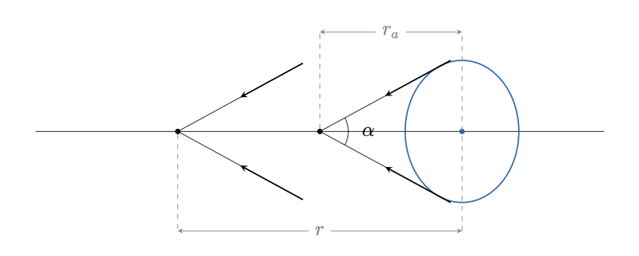

## 3. Расстояния в космологии

### 3.1 Виды расстояний

::: {.definition title="Сопутствующее расстояние"}
1) Сопутствующее расстояние -- величина, соответствующая реальному расстоянию от одного объекта до другого (измеренному, например очень большой линейкой) в некоторый фиксированный момент времени $t_0$, равный для обоих объектов. При этом сопутствующее расстояние не изменяется при расширении вселенной, координатная сетка этого расстояния ''растягивается'' как бы вместе с вселенной. Как правило за $t_0$ удобно взять нынешний момент времени. Обозначим это расстояние как $r_c$.
:::

Рассмотрим путь, который проходит свет от объекта A до объекта B (считаем, что свет "вышел" от объекта A в момент $t_1$ и "пришёл" к объекту B в момент $t_0$). Именно по этой траектории мы и будем измерять расстояние, так как она является кратчайшей. Однако некорректно взять за сопутсвующее расстояние длину пути который прошёл свет ($c\cdot(t_0-t_1)$), потому что в процессе пути вселенная расширялась, а нам нужно расстояние именно для момента $t_0$.

Тогда, чтобы получить сопутствующее расстояние нам нужно просто в каждый момент времени, когда двигался свет отнормировать расстояние, которое он прошёл на масштаб, который у вселенной в момент $t_0$. Так как в каждый момент времени масштабный фактор во вселенной отличается разобьём путь света на отрезки длиной $c\cdot dt$, который свет проходил, соответственно, за $dt$, и каждый отрезок отдельно отнормируем на момент $t_0$, а потом просто просуммируем.

Из определения масштабного фактора:

$$
d r_c = \frac{c\cdot dt}{a(t)}a(t_0)
$$

Здесь $d r$ -- расстояние, которое прошёл свет в момент $t$
за $dt$, отнормированное на момент времени $t_0$. Теперь нам осталось просто сложить все эти отрезки. Получаем:

::: {.formula-box caption="Выражение для сопутствующего расстояния"}
$$
r_c = \int_{t_1}^{t_0} d r_c = \int_{t_1}^{t_0} \frac{c\cdot dt}{a(t)}a(t_0) = a(t_0)\int_{t_1}^{t_0} \frac{c\cdot dt}{a(t)}
$$
:::

::: {.definition title="Собственное расстояние"}
Собственное расстояние -- величина, соответствующая реальному расстоянию от одного объекта до другого (измеренному, например очень большой линейкой) в некоторый момент времени, равный для обоих объектов. Собственное расстояние, в отличии от сопутствующего изменяется при расширении вселенной, так как оно учитывает расширение вселенной. Обозначим это расстояние как $r_p$.
:::

При этом несложно заметить, что в момент времени $t_0$ (и только тогда) сопутствующее и собственное расстояния совпадают.

Собственное расстояние вычисляется аналогично сопутствующему, с той лишь разницей, что оно измеряется не для фиксированного момента $t_0$, а вообще для любого момента $t_p$. Проводя аналогичные рассуждения получим:

::: {.formula-box caption="Выражение для собственного расстояния"}
$$
r_p = \int_{t_1}^{t_p} d r_p = \int_{t_1}^{t_p} \frac{c\cdot dt}{a(t)}a(t_p) = a(t_p)\int_{t_1}^{t_p} \frac{c\cdot dt}{a(t)}
$$
:::

::: {.definition title="Углвоое расстояние"}
Угловое расстояние -- это такое расстояние, при наблюдении с которого объект с линейным размером $D$ имел бы угловой размер $\theta$ (в Евклидовой геометрии, если бы вселенная не расширялась). Обозначим это расстояние как $r_a$. Для малых углов (что почти всегда справедливо в космологии):

$$
r_a = \frac{D}{\theta}
$$
:::

::: {.definition title="Фотометрическое расстояние"}
Фотометрическое расстояние -- это такое расстояние, при наблюдении с которого объект со светимостью $L$ имел бы освещённость $E$ (в Евклидовой геометрии, если бы вселенная не расширялась). Обозначим это расстояние как $r_f$.

$$
r_f = \sqrt{\frac{L}{4\pi E}}
$$
:::

### 3.2 Связь разных расстояний между собой

Проще всего записать связь сопутствующего и собственного расстояний. Действительно, в момент $t_0$ они равны, а потом сопутствующее остаётся таким же, а собственное увеличивается вместе с расширением вселенной. Значит их отношение будет просто равно отношению масштабных факторов:

$$
\boxed{
\frac{r_c}{r_p} = \frac{a(t_0)}{a(t_p)}
}
$$

Здесь $t_p$ -- момент, когда мы измеряем собственное расстояние. Теперь свяжем угловое и фотометричеcкое расстояния с собственным. Начнём с углового.

Пусть мы наблюдаем некоторый объект. Рассмотрим принятые нами фотоны, которые были излучены краями объекта. Угол между их траекториями $\alpha$ должен и будет равен угловому размеру объекта. При этом этот угол должен оставаться постоянным при расширении вселенной, так как она расширяется во все стороны одинаково.

Значит этот угол будет равен истинному (если бы свет доходил мгновенно) угловому размеру галактики в момент, когда фотоны были излучены. Получается, что угловое расстояние в точности равно собственному расстоянию в момент, когда фотоны были излучены. Тогда, считая, что сейчас $a_0 = 1$ получаем:

::: {.formula-box caption="Связь углового и собственного расстояний"}
$$
r_a = r_p\cdot a(t) = \frac{r_p}{1+z}
$$
:::

Теперь перейдём к фотометрическому расстоянию. Сначала выразим его через собственное расстояние в момент, когда приходящие к нам фотоны были излучены. Освещённость пропорциональна плотности энергии, а она в свою очередь, как мы знаем, пропорциональна $a^{-4}$.

Тогда можем сравнить приходящую освещённость от объекта $E$ и то, какая бы приходила от него освещённость $E_e$, если бы вселенная не расширялась и расстояние между наблюдателем и объектом было равно собственному расстоянию между нами в момент, когда фотоны были излучены. Получаем, с учётом того, что сейчас $a_0 = 1$:

$$
\frac{E_e}{E} = a(t)^{-4} = \sqrt{\frac{r_f}{r_e}}
$$

Здесь $r_e$ -- как раз собственное расстояние в момент, когда фотоны были излучены. Тогда получаем:

$$
\frac{r_f}{r_e} = a(t)^{-2}
$$

Осталось только выразить $r_e$ через собственное расстояние в данный момент $r_p$. Зная, что $r_e = a\cdot r_p$ получаем:

::: {.formula-box caption="Связь фотометрического и собственного расстояний"}
$$
r_f = r_p\cdot a(t)^{-1} = r_p\cdot(1+z)
$$
:::