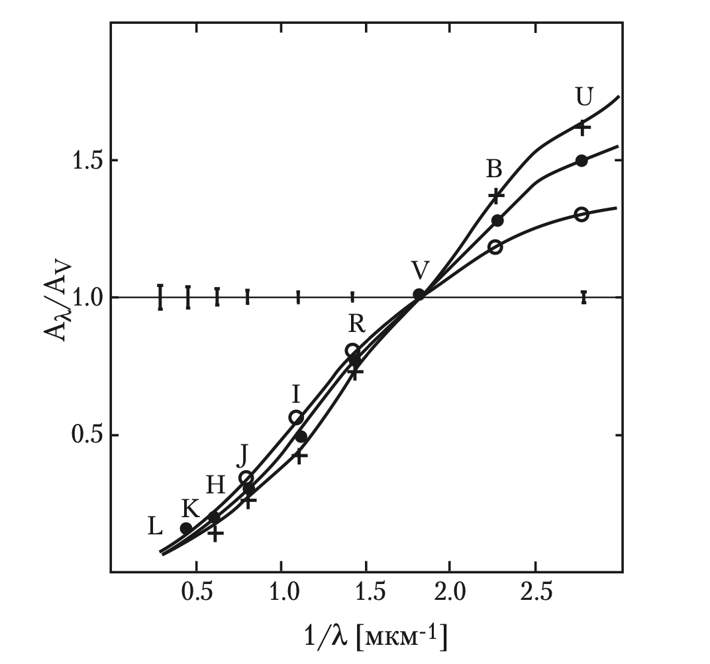
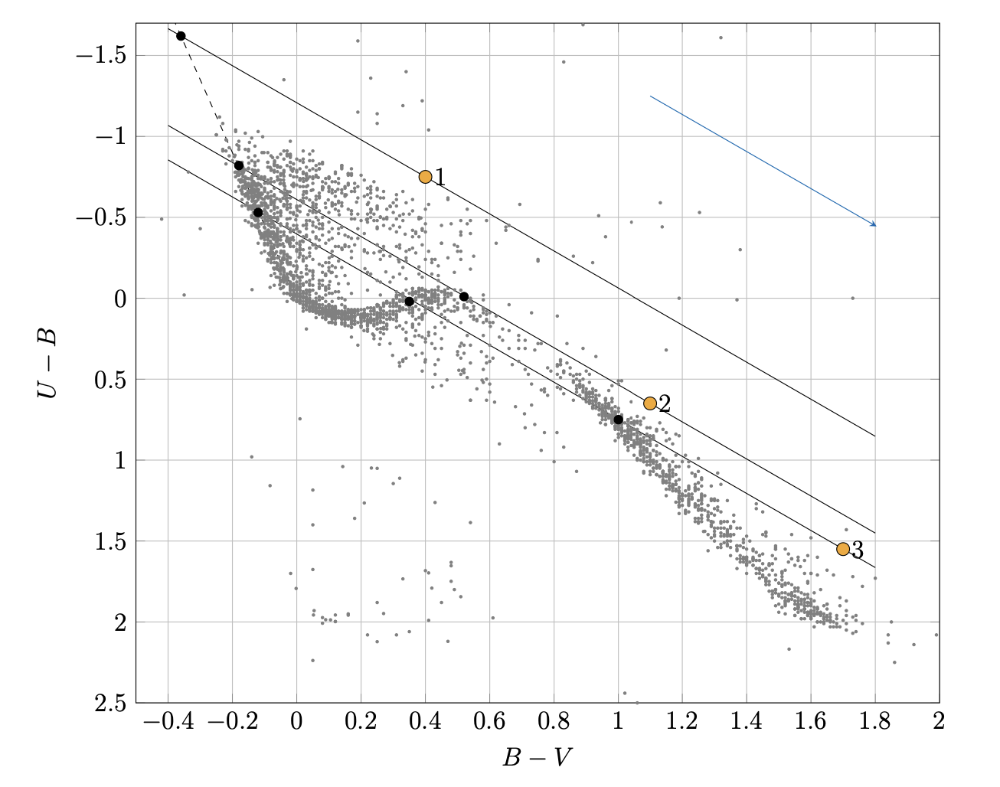

## 1. Поглощение в нашей галактике

Основные причины и характер ослабдения света в галактике зависят от спектрального диапазона, в котором проводят наблюдения:

+ Для УФ, видимомого и ИК диапазонов основную роль играет поглощение межзвёздной пылью.

+ В УФ диапазоне более важную роль (по сравнению с видимым и ИК) начинает играть рассеяние на мелких пылинках.

+ В области радиоволн поглощение практически отсутвтвует.

Отметим, что пылинки, поглощая свет в УФ и видимом диапазонах потом переизлучают его уже в дальнем ИК-диапазоне.

Удельное поглощение в галактике может изменяться в широких пределах. Наибольшее среднее значение оно имеет ожидаемо в плоскости диска нашей галактики, где и находится основная часть газа и пыли. В окрестностях Солнца основной вклад в ослабление света вносят газопылевые облака. При этом даже в диске могут быть как окна прозрачности (когда на луче зрения практически нет облаков), так и области с огромным поглощением.

Среднее удельное поглощение в видимом диапазоне в диске галактике обычно принимают равным:

$$
\boxed{
\langle a_V \rangle = 2^m/кпк
}
$$

Однако к этой величине стоит относиться именно как к среднему, потому что в реальности она может очень сильно отличаться для разных точек в галактике и для разных лучей зрения. 

Зачатсую исходя из неё можно оценить расстояние до объекта. Например, если мы знаем полное поглощение в фильтре $V$, то расстояние можно оценить как просто отношение:

$$
r \approx \frac{A_V}{\langle a_V \rangle}
$$

Интересно, что среднее удельное поглощение в галактике уменьшается, при увеличении наблюдаемой галактической широты и выходит на плато примерно при $b = 50^{\circ}$.

## 2. Зависимость поглощения от длины волны

Величина удельного поглощения в межзвёздной среде зависит от длины волны. Причём зависимость не монотонна и достигает своего максимума при $\lambda = 220$ нм.

На графике предствлена зависимость среднего удельно поглощения от длины волны, нормированного на среднее удельное поглощение в фильтре V (в наших обозначения по оси ординат должны быть строчные $a$ вместо заглавных). Из графика видно, что поглощение вызодит на максимум в синей части спектра (хотя он сам и не попал на диаграмму).

Как видно из графика в областях ближнего УФ, видимого и ближнего ИК диапазонов поглощение практически обратно пропорционально длине волны. Более точное выражение имеет следующий вид:

::: {.formula-box caption="Зависимость удельного поглощения от длины волны"}
$$
\langle a_\lambda \rangle \sim \lambda^{-1.3}
$$
:::

Сразу оговоримся, что в таком виде оно применимо именно для видимого диапазона и ближних границ УФ и ИК. Значение коэффициента $1.3$ также носит очень приближённый характер. В реальности он может меняться примерно от $1$ до $2$, однако особенно в астрономических олимпиадах как правило берётся именно значение $1.3$ или близкие к нему.

Если честно говорить про поглощение в фильтре, то понятно, что придётся интегрировать поглощение по длинам волн. Однако на практике можно опять же воспользоваться тем, что фильтр как правило находится в узком диапазоне длин волн/частот. Тогда:

$$
A_{\lambda X} \sim \lambda^{-1.3}
$$

Здесь $\lambda X$ -- характерная длина волны, соответствующая фильтру. Как правило можно брать просто длину волны середины фильтра.

Отдельно отметим, что зная длины волн фильтров и поглощение в одном из них, поглощения во всех остальных фильтрах также восстанавливаются (из полученного выше соотношения).

Так как максимальное поглощение наблюдается в синей области спектра прохождение света через межзвёздную среду приводит к его покраснению. При этом чем больше свет поглотился, тем больше и эффект покраснения.

## 3. Избытки цвета

Введём количественную меру покраснения света при прохождении через среду.

::: {.definition title="Избыток цвета"}
Избытком цвета $E_{X - Y} для показателя цвета $X - Y$ называется изменение показателя цвета при прохождение через среду:

$$
E_{X - Y} = (X - Y) - (X - Y)_0
$$
:::

Здесь $(X - Y)$ это наблюдаемый показатель цвета, а $(X - Y)_0$ -- показель цвета объекта без учёта поглощения, по сути его реальный показатель цвета.

Преобразуем это выражение:

$$
E_{X - Y} = (X - Y) - (X - Y)_0 = (X - X_0) - (Y - Y_0)
$$

Получаем зависимость избытка цвета от поглощений в фильтрах:

$$
\boxed{
E_{X - Y} = A_X - A_Y
}
$$

Интересно, что так как поглощение в фильтрах связаны между собой отношением их длин волн и выражаются через друг друга, избыток цвета также может быть выражен лишь через поглощение в одном из фильтров (при том в любом).

::: note

Покажем, как это сделать, например, для связи избытка цвета $B - V$ и поглощения в фильтре $V$ - $A_V$:

$$
E_{B - V} = A_B - A_V = A_V \cdot \left (\frac{A_B}{A_V} - 1 \right ) = A_V \cdot \left (\left (\frac{\lambda_B}{\lambda_V} \right)^{-1.3} - 1 \right )
$$

Так как мы знаем длины волн, получаем просто выражение для связи избытка цвета и поглощения.

:::

Зачастую удобно рассматривать отношения следующего вида:

$$
\frac{A_X}{E_{Y - Z}} = k_{XYZ}
$$

Как мы показали ранее здесь избыток цвета может быть однозначно выражен через поглощение, а значит $k_{XYZ}$ является просто константой, соответствующей этой комбинации фильтров.

На самом деле коэффициенты $k_{XYZ}$ можно воспринимать и как эмпирически померянные величины, потому что в том числе из них и получается та оценка на степень длины волны в зависимости для удельного полгощения.

Самым частым случаем применения формулы является связь поглощения в видимом диапазоне и избытка цвета $B - V$. Для него эмпирически было промеряно:

$$
\frac{A_V}{E_{B - V}} = k_{VBV} \approx 3.1
$$

Получим это же выражение исходя из формулы зависимости поглощения в фильтре от длины волны:

$$
\frac{A_V}{E_{B - V}} = \frac{A_V}{A_B - A_V} = \frac{1}{\frac{A_B}{A_V} - 1} = \frac{1}{\left (\frac{\lambda_B}{\lambda_V} \right)^{-1.3} - 1} = k_{VBV}
$$

Подставляя значения длин волн для середин фильтров получаем:

$$
\frac{A_V}{E_{B - V}} = \frac{1}{\left (\frac{445 нм}{551 нм} \right)^{-1.3} - 1} \approx 3.1
$$

Итого, мы получили результат примерно совпадающий с измерениями.

## 4. Двухцветная диаграмма

::: {.definition title="Двухцветная диаграмма"}
Двухцветной диаграммой называется диагармма, по осям которой отложены два показателя цвета.
:::

Ниже представлен пример двухцветной диаграммы для показателей цвета $B - V$ и $U - B$. На диграмму нанесены звезды до $6^{m}$. Так как большая часть таких звёзд лежит в окрестности Солнца поглощение для них невелико и их расположение практически не искажено покрасеннием (кривая с повышенной плотностью звёзд).

При этом на диаграмме также видно достаточно много выбросов. Они соответствуют ярким звёздам на больших расстояних, для которых эффект покраснения становится заметен. Интересно, при увеличении поглощения звёзды по этой диаграмме должны двигаться конкретным образом.

Действительно, отхождение от реального положения (область с повышенной плотностью) характеризуется избытками цвета (по оси $x$ - $E_{B - V}$, по оси $y$ - $E_{U - B}$). Понятно, что оба избытка цвета можно выразить через поглощением в одном и том же фильтре, а значит отношение избытков цвета также является константным.

Итого, получаем, что при покраснении звёзды будут сдвигаться на диаграмме вдоль прямых с фиксированным наклоном (на диаграмме это голубая прямая, направление смещения показано стрелкой).

Если для далёких звёзд с большим поглощением (по сути выбросы на этой диаграмме) провести эту прямую в обратном направлении до пересечения с кривой реального расположения звёзд (область повышенной плотности на диаграмме), то можно узнать реальные показатели цвета, а значит и поглощение, откуда уже можно перейти к расстоянию. 

Отдельно заметим, что однозначность ответа при этом не гаарнтирована. Например, для звёзд $2$ и $3$ на диаграмме видно, что для них существует несколько возможных изначальных расположений. Все эти рассуждения можно повторить и для других двухцветных диаграмм.

