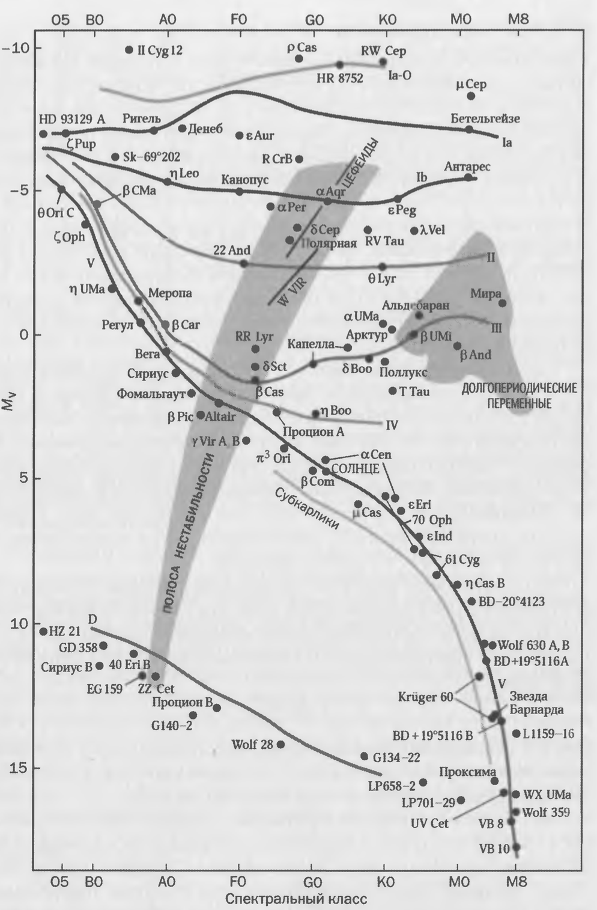
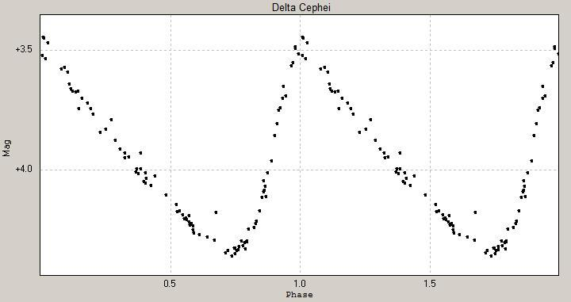

## 1. Возникновение пульсаций

Важным физическим эффектом, наблюдающимся на поздних стадиях эволюции звезд, являются крупномасштабные радиальные колебания звезды как целого. Радиальные пульсации присущи всем звездам, однако только у некоторых звезд, находящихся на поздних стадиях эволюции после главной последовательности, эти пульсации приобретают крупномасштабный характер.

Опишем относительно простую модель возникновения пульсаций, предложенную Эддингтоном. Идея в том, что пульсационная неустойчивость возникает когда поток энергии, идущий из ядра постепенно уменьшается из-за возрастания коэффициента непрозрачности среды $\kappa$ в некотором слое. По сути поток энергии частично запирается внутри этого слоя, создавая дополнительное давление. В итоге, под действием этого давления слой (вместе со звездой) расширяется и охлаждается.

После этого коэффициент непрозрачности падает, и слой (опять же вместе со звездой) начинает сжиматься обратно, причём за счёт инерции он сожмётся уже сильнее первоначального состояния. После этого опять же непрозрачность возрастёт, вместе с ней давление и механизм начнёт повторяться, создавая пульсации.

Принцип по сути похож на колебание пружинки. Изначально мы её оттянули (из-за возникновения слоя с повышенной непрозрачностью), а после этого как бы отпустили, запустив таким образом колебания.

При этом принципиально важным для осуществления работы механизма оказалось наличие в звёздах областей ионизированного водорода/гелия, с которых и начинается механизм запуска пульсаций. Чтобы пульсации существовали необходимо, чтобы слои с этими областями находились не слишком глубоко в звезде (для холодных звёзд с температурой поверхности меньше $5500$ К) и не слишком близко к поверхности (для горячих звёзд с температурой поверхности больше $7500$ К). Отсюда и получаем характерные температуры у пульсирующих звёзд ($5500 < T < 7500$ К).

На графике изображена диаграмма Герцшпрунга-Рассела с нарисованной на ней полосой нестабильности (место на диаграмме, в котором находятся переменные звёзды). Как мы видим, основная часть полосы нестабильности примерно соответствует указанным нами температурам.

## 2. Характерный период пульсаций

Перейдём к оценке характерного периода пульсаций. Хорошую оценку на период колебаний можно получить, используя упрощённую модель, предложенную Эддингтоном. Он предположил, что радиальные колебания носят характер звуковых волн, возбуждаемых при переносе тепла из недр наружу.

Итак, рассмотрим звезду массы $M$ и радиуса $R$, состоящую из идеального газа. Тогда период колебаний может быть выражен так:

$$
T \approx \frac{2R}{v},
\qquad
v=\sqrt{\frac{\gamma P}{\rho}}
$$

Здесь $v$ -- характерная скорость звука в звезде, $\rho$ -- её средняя плотность. Характерное отношение плотности к давлению можем оценить из уравнения гидростатического баланса (считая, что плотность и давление падают до $0$ у поверхности звезды):

$$
\frac{dP}{dr}
=
-
\frac{GM(r)\rho}{r^2}
\Rightarrow
\frac{P}{\rho}
\approx
\frac{GM}{R}
$$

Подставляя, получим:

$$
T
=
\frac{2R}{\sqrt{\gamma P/\rho}}
=
\frac{2R}{\sqrt{\gamma GM/R}}
=
\frac{1}{\sqrt{\pi/(3\gamma)}}
\frac{1}{\sqrt{G\rho}}
$$

::: {.formula-box caption="Выражение для характерного периода пульсаций звезды"}
$$
T \approx \frac{1}{\sqrt{\gamma G\rho}} \sim \frac{1}{\sqrt{ G\rho}}
$$
:::

Более точное выражение имеет вид:

$$
T= \sqrt{\frac{3\pi}{2G\rho}}
$$

Данное выражение хорошо согласуется с наблюдаемыми данными.

На самом деле зависимость $T \sim 1/\sqrt{G\rho}$ очень логична. Действительно, характерное время свободного падения газа на звезду можно оценить из третьего закона Кеплера (используя вырожденный эллипс):

$$
T_0
=
\sqrt{\frac{4\pi^2(R/2)^3}{GM}}
=
\sqrt{\frac{\pi^2R^3}{2GM}}
=
\sqrt{\frac{3\pi}{8G\rho}}
$$

Видим, что время свободного падения опять же пропорционально $1/\sqrt{G\rho}$, при этом понятно, что период пульсаций должен в свою очередь быть пропорциональным $T_0$, откуда можно сделать вывод о том, что $T \sim 1/\sqrt{G\rho}$. На самом деле можем даже заметить, что $T \approx 2T_0$.

## 3. Зависимость период-светимость для цефеид

Важнейшим свойством многих переменных пульсирующих звёзд является связь периода и светимости. Самая известная такая зависимость относится к Цефеидам. Именно благодаря такой связи мы, измеряя период переменности, можем определять светимости звёзд, а зная приходящий поток от них, получать расстояния. Этот метод очень часто используется в астрофизике, например, для нахождения расстояния до галактик / звёздных скоплений.

Современная зависимость для цефеид выглядит следующим образом:

::: {.formula-box caption="Зависимость период-светимость для цефеид"}
$$
\lg(L_V)
=
1.15\,\lg(T)
+
2.34
$$
:::

Здесь $L_V$ -- средняя за период светимость в фильтре $V$ в светимостях Солнца, а $T$ -- период цефеиды.

На графике изображена кривая блеска переменной звезды $\delta$ Cep, ставшей прародительницей класса цефеид.