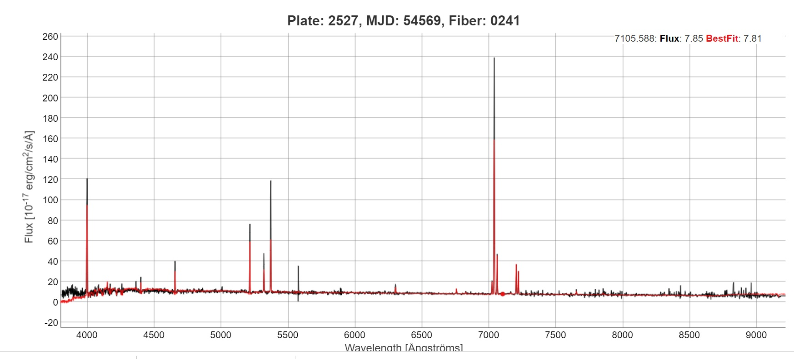
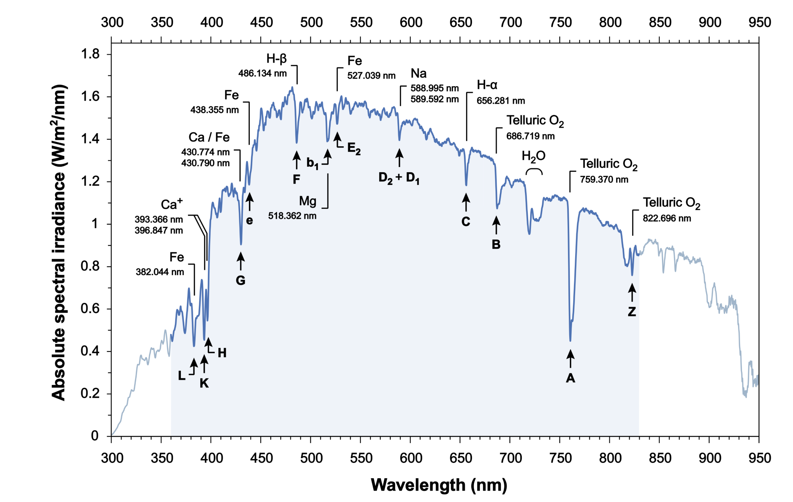
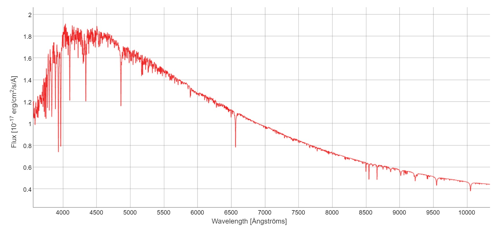

## 1. Анализ решения уравнения переноса

Проанализируем полученное нами решение уравнения переноса $\eqref{Sol_perenos}$ для случая с постоянной функцией источника (постоянной температурой).

Для анализа удобно рассматривать не только его, но и его производную, которая по сути является уравнением $\eqref{perenos}$:

$$
\frac{\dd I_\nu}{\dd \tau_\nu} = S_\nu - I_\nu
$$

1) В случае, если $I_\nu > S_\nu$ (в случае выполнения ЛТР это означает, что горячее излучение проходит через более холодный слой) интенсивность падает вдоль луча зрения (среда поглощает больше, чем излучает):

$$
\frac{\dd I_\nu}{\dd \tau_\nu} = S_\nu - I_\nu < 0
$$

2) Обратно, если $I_\nu < S_\nu$ (в случае выполнения ЛТР это означает, что холодное излучение проходит через более горячий слой) интенсивность будет врзрастать вдоль луча зрения (среда излучает больше, чем поглощает):

$$
\frac{\dd I_\nu}{\dd \tau_\nu} = S_\nu - I_\nu > 0
$$

3) Теперь рассмотрим случай оптически толстой среды. При больших $\tau_\nu$ выходящая из слоя интенсивность будет стремиться к функции источника:

$$
I_\nu = S_\nu
$$

Поясним физический смысл. В оптически толстых средах начальное излучение до нас практически не доходит из-за поглощения. Тогда на первый план выходит излучение самой среды. При этом из-за того, что среда поглощает и своё излучение мы будет видеть его в основном с прозрачной для нас части, то есть до оптической толщины $1$, что и соответствует функции источника. Понятно, что будут фотоны, которые долетят и с большего расстояния, а будут и те, которые успеют поглотиться и на этом участке, тут значение $1$ стоит воспринимать как усреднение.

В случае, если выполняется ЛТР (и среда оптически толстая) спектр будет стремиться к Планковскому (из закона Киргофа):

$$
I_\nu = S_\nu = B_\nu
$$

Именно поэтому, например, звёздные спектры близки к Планковским. При этом заметим, что температура Планковской кривой должна соответствовать именно температуре этой оптически толстой среды. В случае звёзд это температура фотосферы.

## 2. Образование спектральных линий

Дадим несколько определений:

::: {.definition title="Спектральная линия"}
Спектральная линия — это узкий участок спектра, на котором интенсивность излучения отличается от окружающего фона из-за резкого изменения коэффициентов излучения $j_\nu$ или поглощения $\alpha_\nu$ на определённых частотах.
:::

::: {.definition title=“Континуум”}
Континуум — это гладкая составляющая спектра, возникающая при излучении в широком диапазоне частот. В отличие от спектральных линий, он не связан с резкими изменениями интенсивности на отдельных частотах и формирует общий фон спектра. Например для звёздных спектров континуум неплохо описывается функцией Планка.
:::

Понятно, что если на какой-то частоте в среде поглощение резко больше, чем на остальных частотах, то в спектре мы будем видеть линию поглощения или линию излучения (так как коэффициенты поглощения и излучения могут быть связаны).

Спектральные линии появляются, например, на длинах волн, соответствующим переходам между энергетическими уровнями атомов(так как при таких длинах волн фотон может поглощаться(излучаться) атомом и поглощение(излучение) в них значительно возрастает). Похожий принцип и при образровании других линий, только механизм поглощения или излучения будет уже другой.

Линии излучения часто называют эмисионными, а линии поглощения - абсорбационными. Рассмотрим среду в случае постоянной функции источника (постоянная температура в среде).

### 2.1. Случай оптически тонкой средой

Рассмотрим два принципиально разных случая:

#### 2.1.1. Образование линий излучения

Пусть оптически тонкая среда подсвечивается излучением с интенсивностью, меньшей, чем функция источника среды (или фоновая подсветка и вовсе отсутствует). В случае выполнения ЛТР и чернотельности подсветки это будет эквивалентно тому, что холодный источник подсвечивает горячую среду.

Как мы знаем из анализа решения в такм случае среда будет усиливать излучение. С учётом $\tau_\nu << 1$ (так как среда оптически тонкая):

$$
I_\nu (\tau_\nu) = S_\nu + e^{-\tau_\nu} \cdot(I_\nu(0) - S_\nu) \approx S_\nu + (1 - \tau_\nu) \cdot (I_\nu(0) - S_\nu) 
$$

$$
I_\nu (\tau_\nu) = I_\nu(0) +  (S_\nu - I_\nu (0)) \cdot \tau_\nu
$$

Таким образом, так как мы считаем, что среда более горячая, чем подсветка ворое слагаемое будет положительным, а значит на фоне подсветки будут появляться линии излучения на частотах, где $\tau_\nu$ имеют острый максимум.

Такие линии видны в спеткрах планетарных туманностей, сверхновых и галактиках.

#### 2.1.1. Образование линий поглощения

Пусть теперь оптически тонкая среда подсвечивается источником с большей интенсивностью, чем функция источника среды. В случае выполнения ЛТР чернотельности подсветки это будет эквивалентно подсветки холодной среды горячим источником.

В таком случае наоборот среда будет уменьшать интенсивность (причём сильнее там, где больше оптическая толщина, то есть в линиях). Аналогично прошлому пункту:

$$
I_\nu (\tau_\nu) = I_\nu(0) +  (S_\nu - I_\nu (0)) \cdot \tau_\nu
$$

Однака здесь мы уже считаем, что второе слагаемое отрицательное, поэтому и возникает поглощение. Опять же в острых максимумах $\tau_\nu$ будут возникать линии поглощения.

Отдельно отметим, что в обоих этих случая можно оценить то, насколько линия выделяется из континуума (или обратно, зная высоту линии оценить поглощение в среде):

$$
\Delta I = (S_\nu - I_\nu (0)) \cdot \tau_\nu
$$

Этот случай реализуется, например, когда свет от звезды проходит через межзвёздные облака или при прохождении света через земную атмосферу.

### 2.2. Случай оптически толстой среды

Вернёмся к нашему решению уравнения переноса для случая постоянной температуры $\eqref{Sol_perenos}$. В этом случае, как мы уже говорили ранее, второе слагаемое будет стремиться к $0$ при стремлении оптической толщины к бесконечности, а значит сам спеткр будет стремиться просто к функции источника (в случае ЛТР к Планковскому континууму).

### 2.3. Звёздные спектры.

Теперь рассмотрим случай, когда среда находится в промежуточном режиме, то есть её оптическая толщина порядка единицы. Однако даже в таком случае, если интенсивность входящего излучения будет равна функции источника (то есть $I_\nu(0) = S_\nu$) спектр опять же будет равен функции источника и никаких линий в нём не будет. В случае выполнения ЛТР (и чернотельности входящего излучения) описанный случай соответствует равенству температур подсветки и среды.

Рассмотрим случай звёздных фотосфер. В них, помимо того,что среда имеет оптическую толщину порядка $1$, оказывается значительной разница между входящей интенсинвостью и функцией источника, что в условиях выполнения ЛТР (что для звёздных фотосфер близко к правде) соответствует большому изменению температуры.

Качественно опишем, почему же в звёздных фотосферах появляются линии. Итак, как знаем, линии поглощения должны появляться при больших (относительно континуума) оптических толщинах. Тогда фотоны, которые мы видим в этой линии должны быть излучены на небольшой глубине в звезде (так как они быстрее поглощаются). В фотоны континнума, для которых поглощение значительно меньше могут быть излучены и на гораздо большей глубине в звезде. Таким образом понятно, что в случае линии излучение формируется в более холодном слое звезды и интенсивность там заведомо меньше, чем в остальном спектре.

Теперь попробуем это описать с точки зрения функции источника. Для простоты положим, что в фотосфере температура принимает 2 значения, на внутренней границе она горячее, а на внешней холоднее. С учётом выполнения ЛТР можем записать:

$$
I_\nu (\tau_\nu) = B_\nu + e^{-\tau_\nu} \cdot(I_\nu(0) - B_\nu)
$$

Теперь посмотрим на то, чем является член $I_\nu(0)$. По сути это входящая в фотосферу интенсивность. Так как среда внутри звезды непрозрачна и находится в ЛТР можно считать, что её спектр также Планковский ($I_\nu(0) = B_\nu(0)$), но принципиально с большей температурой (так как внутренность звезды горячее её фотосферы). Таким образом:

$$
I_\nu (\tau_\nu) = B_\nu + e^{-\tau_\nu} \cdot(B_\nu(0) - B_\nu)
$$

Заметим, что при больших оптических толщинах $\tau_\nu$ добавка становится меньше. При этом второе слагаемое положительное (так как среда внутри звезды горячее фотосферы). При больших $\tau_\nu$ вклад горячего внутреннего излучения сильнее подавляется. Поэтому в местах максимума $\tau_\nu$ интенсивность оказывается ближе к излучению более холодного внешнего слоя, чем в континууме, и возникают линии поглощения.

