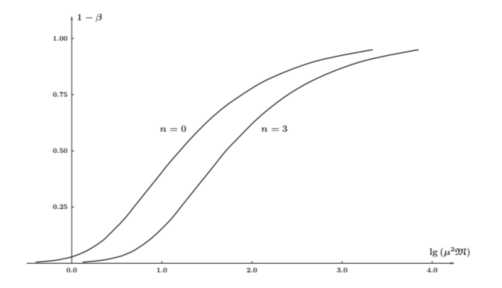

## 1. Оценка давления излучения в центре звезды

Оценим, насколько большой вклад вносит давление излучения, и как он зависит от массы звезды.

Обозначим за $\beta$ вклад давления газа в общее давление в центре звезды. Таким образов когда $\beta = 0$ давление газа пренебрежимо мало по сравнению с давлением излучения, а когда $\beta = 1$, то наоборот. Тогда $\beta$ может быть выражена через массу звезды (в массах Солнца) и молярную массы (опять же в центре звезды, в г/моль) следующим образм:

$$
\boxed{
\frac{\beta^4}{1-\beta}
\approx
\frac{30.5[M_\odot^2 \text{г}^4/\text{моль}^4]}{b_0}
\frac{1}{M^2\mu^4}
}
$$

Сразу отметим, что значение вклад давления излучения растёт по мере увеличения массы звёзд (и $\mu$).

Осталось оценить значение $b_0$. Заметим, что для однородного шара значение равно $1$, при этом оно максимально. Оказывается, что значение $b_0$ относительно слабо чувствительно к структуре. Например, если плотность убывает квадратично, то $b_0 = 0.4$. 

Для нас наиболее важным является случай стандартной модели Эддингтона, по сути политропы с $n = 3$. **В таком случае $\beta$ оказывается постоянным по всему радиусу звезды.** Для такого случая $b_0 \approx 0.092$. 

Зная максимальное значение $b_0 = 1$ можем написать оценку снизу на значение $\beta$ (по сути для случая однородного шара):

$$
\frac{\beta}{\sqrt[4]{1-\beta}}
\ge
\frac{2.35}{\sqrt{M\mu^2}}
$$

Оценим снизу долю давления излучения для Солнца. Тогда:

$$
\frac{\beta}{\sqrt[4]{1-\beta}}
\ge
3.9
\Rightarrow
\beta \ge 0.86
$$

Также можем оценить в рамках стандартной модели:

$$
\frac{\beta}{\sqrt[4]{1-\beta}}
=
\sqrt[4]{\frac{30.5}{0.092}}
\cdot
\frac{1}{0.6}
\Rightarrow
\beta = 0.91
$$

Таким образом можем сделать вывод о том, что в Солнце (по крайней мере в центре) преобладает давление газа. 

<!--  --->

На данном графике изображена модельная зависимость доли давления излучения от $lg(M\mu^2)$ для химически однородных звеёзд с массовой долей водорода $70$ процентов и гелия $27$ процентов. Графики приведены для стандартной модели (политропа $n = 3$) и для оценки сверху (случай однородной звезды, $n = 0$).

Из графика хорошо видно, что даже при больших массах у звёзд $\beta$ остаётся достаточно большим. Оценим наибольшее значение $\beta$. Возьмём характерное значение для максимальной массы звёзд в $10^2 M_\odot$. Такие звёзды хорошо достаточно хорошо можно приблизить стандартной моделью, но даже используя оценку снизу можем получить, что $\beta$ не меньше $0.25$, а значит давление газа в любом случае оказывает существенное влияние.

## 2. Эддингтоновский предел

Итак, как мы уже поняли при увеличении массы звёзд увеличивается вклад давления излучения. Также звёзды с достаточно большой массой как правило хорошо описываются стандартной моделью Эддингтона, а значит в них можно считать, что $\beta$ не зависит от радиуса.

::: {.definition title="Предел Эддингтона"}
Пределом Эддингтона (Эддингтоновской светимостью) называют теоретический предел (наибольшее значение) светимости звезды, при которой она ещё может оставаться в состоянии равновесия.
:::

При светимостях, больших Эддингтоновской почти всегда давление излучения начинает превышать гравитационное давление и звезда по сути начинает сама с себя сдувать слои. Классическое выражение для светимости Эддингтона выглядит следующим образом:

$$
\boxed{
L_{\rm Edd}
=
\frac{4\pi Gm_pc}{\sigma_T}M
\approx
3.25\cdot10^4 L_\odot \frac{M}{M_\odot}
}
$$

Оно получено в приближении, что давление газа пренебрежимо мало, по сравнению с давлением излучения. Если им не пренебрегать можно получить и более общее выражение:

$$
L=\frac{4\pi Gm_pc(1-\beta)}{\sigma_T}M
$$

Отдельно отметим, что в реальности Эддингтоновская светимость для звёзд не достижима, хотя бы потому что у реальных звёзд $\beta$ не может быть равным 0, соответственно светимость должна быть меньше Эддингтоновской хотя бы в $1.5$ - $2$ раза.

## 3. Оценка максимальной массы звёзд Г.П.

Мы знаем, что для массивных звёзд Г.П. можем считать, что:

$$
L \approx M^3
$$

Здесь масса и светимость выражены в солнечных. При этом мы понимаем, что светимость звёзд должна быть ограничена сверху Эддингтоновской светимостью (причём с некоторым запасом):

$$
L < L_{\rm Edd}
$$

Совмещая, получим оценку на верхний предел для масс звёзд на Г.П.:

$$
M^3 < 3.25 \cdot 10^4 \cdot M
$$

$$
\boxed{
M < 180\,M_\odot
}
$$

В реальности эта оценка является завышенной, поскольку опять же $\beta \neq 0$, есть тормозное поглощение и фотоионизация, что увеличивает непрозрачность и уменьшает значение верхнего предела масс.

Также при больших массах ($M > 120-150\,M_\odot$) у звёзд главной последовательности начинается пульсационная неустойчивость, что также влияет на максимально возможную массу. В целом значения максимальной массы звёзд на Г.П. порядка $150\,M_\odot$ является вполне адекватной оценкой.