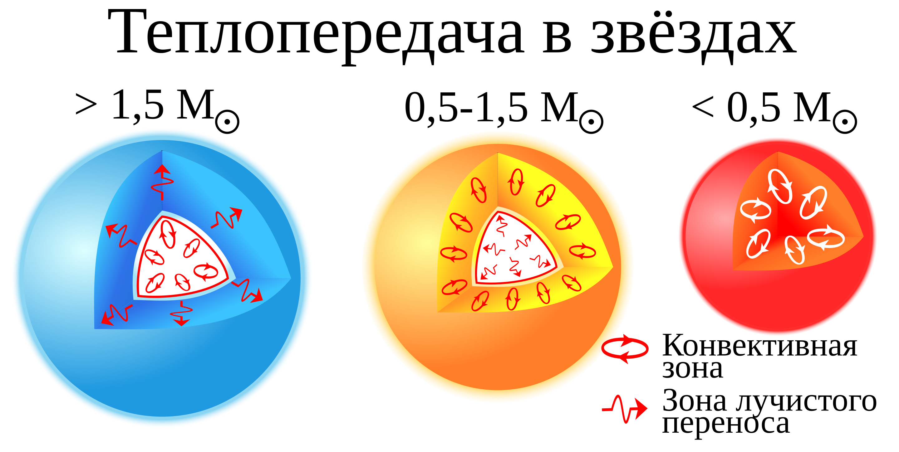

## 1. Введение
Для начала дадим определения тому, что является звездой. Итак, **звезды -- это массивные самогравитирующие шары из полностью или частично ионизованного газа, в течении жизни которых в недрах протекали или будут протекать термоядерные реакции.** При этом именно последнее свойство главным образом отличает звёзды от, например, газовых планет. 

Исходя из нашего определения мы так же относим протозвёзды, белые карлики и нейтронные звёзды к звёздам. Однако сразу оговоримся, что большая часть этой главы посвещена именно обычным звёздам (исключая вышеперечисленные классы, а также случай тесных двойных систем), и, если не исказано иного речь идёт именно про них.

Основными характеристиками, которые определяют строение и эволюцию звезды являются масса, химический состав и возраст. Иначе говоря, звёзды, у которых данный параметры совпадают можно считать практически одинаковыми (за исключением случаев тесных двойных систем).

## 2. Строение

В строении звезды можно выделить $4$ основные элемента, относительные размеры и взаимное распложение которых которых могут достаточно сильно отличаться для различных звёзд. При этом важно отметить, что звёзды сферически симметричны. 

1. Первый элемент в строении звезды, находящийся в её центре это ядро. Для звёзд типа Солнца его радиус составляет примерно $20$ процентов от радиуса звезды, а масса в $3$ раза меньше самой звезды. 

   Именно в звёздном ядре (большую часть жизни) и происходят термоядерные реакции, а выделяющаяся энергия распространяется во внешние слои звезды. Именно это свойство по сути отделяет ядро от остальной звезды. За счёт этого в ядре поддерживается самая большая температура в звезде (для звёзд типа Солнца порядка $15$ миллионов кельвинов). Также это влияет на разность химических составов в ядре и вне его. В остальных слоях звезды доля водорода составляет порядка $70$ процентов, в то время как в ядре его доля сильно меньше (именно за счёт того, что в ядре происходят термоядерные реакции горения водорода).

2. Далее рассмотрим конветивную зону и зону лучистого переноса. Главным образом они отличаются механизмом передачи тепла из внутренних слоёв во внешние. 

   Конвекция является основным механизмом передачи энергии в том случае, когда градиент температуры достаточно велик для того, чтобы выделенный участок газа в звезде поднимался к поверхности. По сути для конвективной зоны характерна передача тепла за счёт перемешивания вещества. 

   В областях с маленьким градиентом температуры и достаточно малой непрозрачностью основным механизмом передачи энергии является лучистый перенос. По сути это механизм переноса тепла за счёт постоянного поглощения и переизлучения гамма-квантов. За счёт того, что фотон переизлучается в произвольном направлении, а среда оптически толстая его путь из ядра до поверхности звезды занимем достаточно большое время (для Солнца, например, порядка $10^5$ лет).

   Для звёзд с различной массой их взаимное месторасположение различается:

   1. Для маломассивных звёзд ($M < 0.5 M_{\odot}$) зона лучистого переноса практически отсутствует, и основную часть звезду (от ядра до фотосферы) занимает именно конветивная зона.

   2. Для звёзд околосолнечной массы ($0.5 M_{\odot} < M < 1.5 M_{\odot}$) к ядру прилегает зона лучистого переноса, а после неё идёт конветивная зона. Для Солнца зона лучистого переноса занимает примерно половину радиуса, а конвективная зона $30$ процентов (вдоль радиуса).

   3. Для массивных звёзд ($M \geq 1.5 M_{\odot}$) напротив, к ядру прилегает конвективная зона, а далее идёт зона лучистого переноса.

   4. С увеличением массы звезды конвективная зона уменьшается и звезда становится в большей степени лучистой. Ядро при этом становится конвективным. 

  

3. Наконец, во внешних слоях звезды находятся фотосфера, хромосфера и корона. 

   1. Фотосфера -- тонкий слой звезды (толщина порядка $10^2$ - $10^3$ км), который и генерирует то излучение, которое мы регистрируем. По сути именно там образуются спектральные линии и сам спектр. Такие эффекты как пятна и потеменение к краю также образуются именно в фотосфере.

   2. Хромомсфера -- премыкающий к фотосфере тонкий слой звезды, темперутра в нём при этом немного меньше, чем в фотосфере.

   3. Корона -- разреженный внешний слой звезды, который практически не излучает. При этом за счёт магнитного поля в нём достигается достаточно большая температура (порядка $10^6$ кельвинов). Размеры короны при этом могут превышать размеры остальной части звезды.

## 3. Состав

Химический состав звезды зависит как от начального количесства водорода, гелия и других элементов в её составе, так и от её возраста, массы.

Например, если есть очень массивная звезда, в которой изначально практически нет тяжелых элементов, то к концу жизни её химический состав заметно изменится, так как она насинтезирует много других химических элементов (кроме водорода и гелия). 

Кроме того в разных частях звезды состав может достаточно сильно различаться (кроме молодых звёзд). Это происходит потому что большую часть жизни звезды термоядерные реакции идут только в ядре, и там доля водорода существенно уменьшается по сравнению с остальной звездой. Характерными массовыми долями элементов в звезде (до начала термоядерных реакций) можно считать:

$$
X \approx 0.7, ~ Y \approx 0.27, ~ Z \approx 0.03
$$

Здесь $X, Y$ и $Z$ соответственно массовые доли водорода, гелия и остальных элементов. При этом понятно, что примерно такой химический состав сохраняется почти всю жизнь звезды на главной последовательности (за исключением ядра).

Исходя из этого мы также можем оценить характерную для звёзд молярную массу, не забыв, что газ в звезде ионизирован (для оценки будем считать что полностью). Тогда на атом водорода приходятся $2$ частицы (протон и электрон), на атом гелия три (альфа-частица и два электрона), а на атом тяжелого элемента число частиц примерно равно заряду ядра (или половине массы). Итого:

::: {.formula title="Средняя молярная масса внутри звезды"}
$$
\mu \approx (2 \cdot X + 3/4 \cdot Y + 1/2 \cdot Z)^{-1} = 0.6
$$
:::

Это и есть характерное значение средней молярной массы в звёздах. При старении звезды доля водорода уменьшается (можно считать, что к концу Г.П. $X \approx 0.6, Y \approx 0.4$), однако даже в этом случае значение $\mu$ получается близким к $0.6$.

Отдельно отметим, что для почти всех звёзд Г.П. (за исключением самых холодных) мы можем счиать газ (даже внутри ядра) идеальным. Это утверждение нам будет необходимо при выводе многих соотношений.