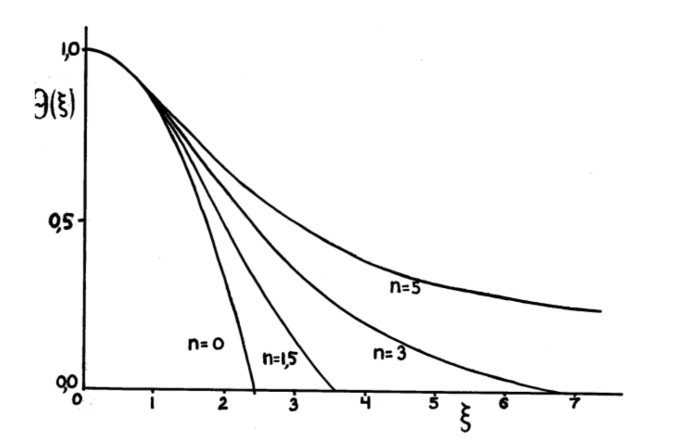

## 1. Описание модели и сравнение с реальностью

Уравнения гидростатического равновесия недостаточно для описания строения звезды, в том числе для нахождения функций температуры, плотности и давления вдоль радиуса. Исторически первыми (и наиболее простыми) моделями звёзд были как раз политропные модели, речь о которых пойдёт в этой статье. Мы будем рассматривать именно их, так как с одной стороны они сравнительно просты для понимания, а с другой вполне неплохо приближают известные нам данные о строении звёзд.

::: {.definition title="Политропа"}
Политропной моделью звезды (политропой) называется гипотетическая звезда, находящаяся в механическом равновесии и такая, что в каждой её точке выполнено:

$$
P = K\rho^{1+\frac{1}{n}}
$$

:::

Здесь $P$ -- давление, $\rho$ -- плотность, $n$ -- индекс политропы, $\gamma = 1 + 1/n$ -- показатель политропы.

Стоит отметить, что политропой с индексом $\infty$ является шар идеального газа с постоянной температурой. При $n=-1$ давление всюду постоянно, а если $n = 1/(\gamma - 1)$, где $\gamma$ -- показатель адиабаты, имеет место адиабатический процесс (без потерь энергии). Однако, в звездной астрофизике обычно рассматривают только политропы с индексами от $0$ до $5$.

Теперь обсудим, насколько хорошо эта модель применима к реальности и для каких звёзд.

1. Опишем звёзды, для которых политропная модель особенно хорошо применима, причём вдоль всего радиуса:

   a. Полностью конвективные невырожденные звёзды (такие как красные карлики с массой $0.3 < M < 0.5$ масс Солнца). Для них хорошо подходит политропа с $n = 3/2$.

   b. Протозвёзды небольших масс, находящиеся на треке Хаяши. Для них также $n = 3/2$.

   c. Белые карлики малой массы. Здесь, опять же, $n = 3/2$.

   d. Белые карлики с массой близкой к максимальной (см. предел Чандрасекара). Для них хорошим приближением будет политропа с $n = 3$.

2. Отдельно отметим, что для звёзд Г.П. с массой больше солнечной как правило очень неплохо подходит политропа с $n = 3$. Этот случай очень важен в физике звёзд.

3. У звёзд с верхней части Г.П. ядро становится конвективным, поэтому для описания их хорошо подойдёт $n = 3/2$ (что похоже на случай 1а). Однако отметим, что такой моделью хорошо описывается лишь ядро в таких звёздах, а не вся звезда.

## 2. Уравнение Лейна-Эмдена

Уравнение Лейна-Эмдена является одним из важнейших в теории политроп и вообще в физике звёзд. Оно описывает строение звезды, находящейся в равновесии в политропной моделе. Уравнение Лейна-Эмдена для распределения плотности по радиусу можно записать так:

$$
\boxed{
\rho \frac{d^2\rho}{dr^2} + \frac{d\rho}{dr}\left(\frac{2\rho}{r}+\frac{1}{n}\right) - \left(\frac{d\rho}{dr}\right)^2 + \frac{n}{n+1}\frac{4\pi G}{K}\rho^{3-\frac{1}{n}}=0
}
$$

Однако, зачастую удобней его получить в безразмерном виде. Пусть $\theta$ -- безразмерный потенциал, выраженный в долях от центрального $\phi_0$. Введём безразмерное расстояние:

$$
\xi=\frac{r}{r_1}, \qquad r_1=\sqrt{\frac{(1+n)K\rho_0^{1/n-1}}{4\pi G}}=\sqrt{\frac{\phi_0}{4\pi G\rho_0}}
$$

Итого, получаем:

::: {.formula title="Уравнение Лейна-Эмдена в безразмерной форме"}
$$
\frac{1}{\xi^2}\frac{d}{d\xi}\left(\xi^2\frac{d\theta}{d\xi}\right)+\theta^n=0
$$
:::

Решением этого уравнения будет зависимость доли потенциала от центрального (отсчитываемого от поверхности) от некого безразмерного расстояния, причём потенциал очень просто связан с плотностью.

На графике изображены решения уравнения Лейна-Эмдена для некоторых $n$.

## 3. Стандартная модель Эддингтона

::: {.definition title="Стандартная модель Эддингтона"}
Стандартной моделью Эддингтона называется модель звезды из идеального невырожденного газа с $\mu = const$, в которой давление излучения составляет постоянную по глубине долю полного давления.
:::

Покажем, что из этого условия следует, что это политропа с $n = 3$.

$$
P_{\mathrm{gas}} = \frac{\rho R T}{\mu}, \qquad P_{\mathrm{rad}} = \frac{4\sigma T^4}{3c}
$$

Рассмотрим отношение этих давлений:

$$
\frac{P_{\mathrm{gas}}}{P_{\mathrm{rad}}} \sim \frac{\rho}{T^3}
$$

Считая, что $P \sim P_{\mathrm{gas}}$ (так как отношение давлений константа) и идельность газа можем использовать:

$$
P \sim P_{\mathrm{gas}} \sim \rho T
$$

Тогда, выражая температуру имеем:

$$
\frac{P_{\mathrm{gas}}}{P_{\mathrm{rad}}} \sim \frac{\rho^4}{P^3} = const
$$

Откуда имеем:

$$
P = K\rho^{4/3} = K\rho^{1+1/3}
$$

Что и соответствует политропе с индексом $3$. Напомним, что такая политропа очень важна для нас, так как неплохо описывает массивные звёзды на Г.П.. Также верно и обратное утверждение (что в политропах с $n = 3$ отношение давлений постоянно). Оставим доказательство как упражнение читателю.

Итак, мы доказали что стандартная модель Эддингтона по сути своей является политропой с $n = 3$ (и обратно, политропа с $n = 3$ эквивалентна стандартной модели).

В итоге можем сформулировать утверждение о том, что для звёзд главной последовательности с массой больше Солнечной хорошо применима стандартная модель Эддингтона. Это утверждение нам потребуется в следующей части лекции.