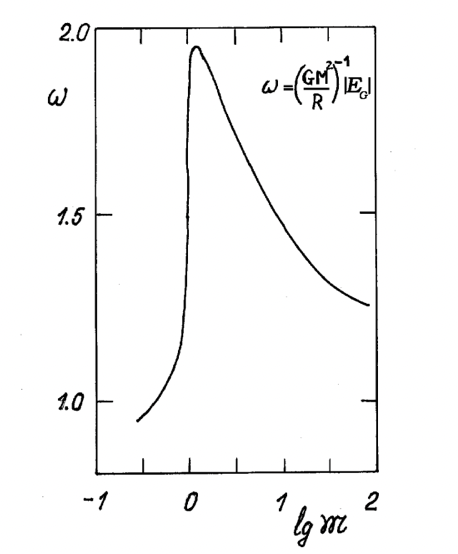
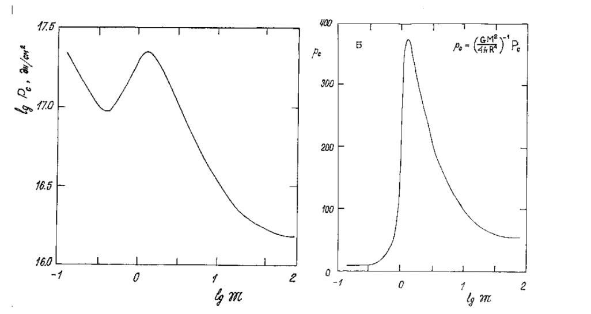
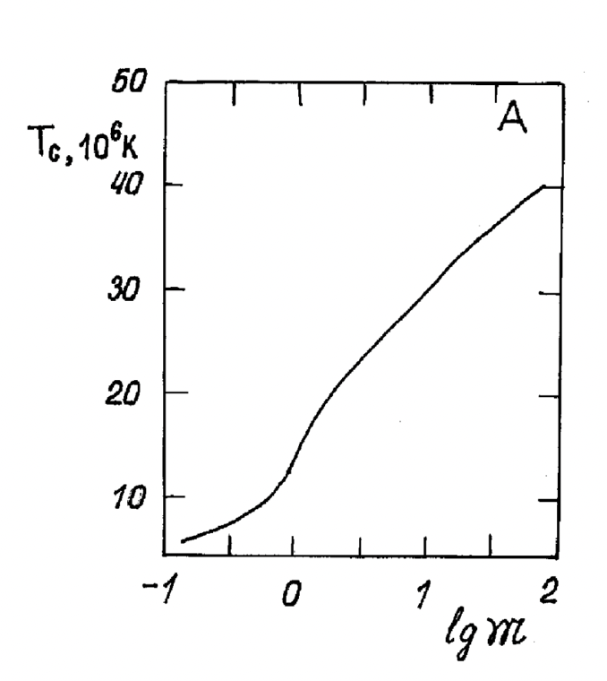

## 1. Отрицательная теплоёмкость звёзд

Запишем полную энергию звезды:

$$
E = E_T + E_R + U
$$

Используя теорему о вириале для идеального одноатомного газа (и не пренебрегая давлением излучения) можем получить:

$$
-E = E_T
$$

Аналогичный результат получается, если в обоих уравнениях пренебречь энергией излучения. Также отметим, что полная энергия $E$ отрицательна. Заметим, что при увеличении энергии в звезде тепловая энегия падает, а значит и характерная температура уменьшается -- по сути звезда расширяется. Обратно, при уменьшении энергии (сжатии звезды) тепловая энергия и температура растут.

По сути описанные условия эквивалентны тому, что вещество звезды имеет отрицательную теплоёмкость:

$$
C=\frac{dE}{dT}=-\frac{dE_T}{dT}<0
$$

Здесь под $T$ подразумевается некая характерная температура, например можно взять температуру в ядре. На самом деле данное свойство играет ключевую роль в том, что звезда остаётся стабильной на протяжении большого количества времени.

Например, как мы знаем всё время жизни звезды её ядро постепенно сжимается, при этом в нём растут давление и температура. Рассмотрим этот процесс с точки зрения сохранения баланса. Итак, ядро звезды немного сжалось, соответственно увеличились плотность и давление гравитации, а полная энергия уменьшилась. Так как звезда имеет отрицательную телпоёмкость её температура увеличилась, соответственно увеличилось и давление газа, которое снова может компенсировать давление гравитации.

Или же, например, при увеличении темпа энерговыделения в недрах звезды она немного расширяется, полная энергия увеличивается, а температура падает, соответственно возвращая темп энерговыделения в норму. Именно по этому термоядерные реакции могут идти миллиарды лет и не носят взрывной характер.

## 2. Оценки физических параметров в звезде

### 2.1. Гравитационная энергии

Итак, как мы уже получали выше, полная гравитационная энергия звезды $U$ может быть выражена следующим образом:

$$
U=-\int_0^M\frac{GM(r)dm}{r}
$$

Переходя к безразмерным параметрам $q=M(r)/M$, $x=r/R$ (здесь $R$ -- радиус звезды) данную формулу удобно переписать в следующем виде:

$$
U=-\int_0^M\frac{GqM^2dq}{xR}=-\frac{GM^2}{R}\int_0^1\frac{q\,dq}{x}
$$

::: {.formula title="Гравитационная энергия звезды"}
$$
U=-\omega\frac{GM^2}{R}, \qquad \omega=\int_0^1\frac{q\,dq}{x}
$$
:::

Известным результатом, например, является то, что для однородного шара $\omega=3/5$. Заметим, что $x<1$, а значит:

$$
\omega\geq\int_0^1q\,dq=\frac{1}{2}
$$

для любых объектов. В реальности $\omega$ достаточно сильно зависит от распределения плотности в звезде, и можем меняться с течением жизни звезды. Для оценки как правило можно использовать:

$$
\omega\approx1
$$

Современные исследования показывают, что для Солнца значение коэффициента $\omega_{\odot}\approx1.62$. Интересно, что для звёзд Г.П. наибольшим $\omega$ (а значит и наибольшей концентрацией массы к центру) обладают звезды с массой $1.5-2M_{\odot}$.

На данном графике изображена модельная зависимость безразмерной гравитационной потенциальной энергии от массы для химически однородных звеёзд с массовой долей водорода $70$ процентов и гелия $27$ процентов.

### 2.2. Давление в ядре

Итак, как мы знаем из механического равновесия:

$$
dP=\frac{GM(r)dm}{r^2}\cdot\frac{1}{4\pi r^2}
$$

Тогда давление в центре можно найти следующим образом:

$$
P_0=\int_0^M\frac{GM(r)dm}{4\pi r^4}
$$

Переходя, аналогично подсчёту гравитационной энергии, к безразмерным параметрам $q=M(r)/M$, $x=r/R$ получим:

$$
P_0=\int_0^1\frac{GM^2q\,dq}{4\pi x^4R^4}
=\frac{GM^2}{4\pi R^4}\int_0^1\frac{q\,dq}{x^4}
$$

::: {.formula title="Давление в центре звезды"}
$$
P_0=p\frac{GM^2}{4\pi R^4}, \qquad
p=\int_0^1\frac{q\,dq}{x^4}
$$
:::

Опять же, можем оценить значение $p$. Так как $x<1$ можем получить:

$$
p\geq\int_0^1q\,dq\geq\frac{1}{2}
$$

Однако мы можем получить и более точную оценку. Заметим, что:

$$
q(x)\geq x^3
$$

Так как иначе плотность звезды или постоянна, или растёт наружу. Тогда:

$$
p\geq\int_0^1\frac{x^3d(x^3)}{x^4}=\frac{3}{2}
$$

$$
P_0\geq\frac{3}{8\pi}\frac{GM^2}{R^4}
$$

При этом чем быстрее будет падать плотность от центра, тем больше будет значение $P$, например для линейного падения плотности $p=5$. Для зависимости плотности от $x$ следующего вида:

$$
\rho=\rho_0(1-x^a)
$$

Где $\rho_0$ -- плотность в центре, а $a$ -- параметр, максимальное значение $p$ получается равным $9$, при $a$, стремящимся к $0$.

Модельное значение $p$ для обычных звёзд ГП даёт значение порядка $140$, а для холодных звёзд порядка $10$. Видим, что коэффициент вносит ошибку равную $1-2$ порядкам, так что по возможности его лучше учитывать/самостоятельно оценивать.

На левом графике изображена модельная зависимость давления в центре звезды от массы, на правом модельная зависимость параметра $p$ от массы. Все данные указаны для химически однородных звеёзд с массовой долей водорода $70$ процентов и гелия $27$ процентов.

Далее мы получим ещё одну оценку на давление в центре, используя уже температуру.

### 2.3. Температуры в звезде

Для оценки температур в звезде будем использовать теорему вириала. Для большинства звёзд давлением излучения можно пренебречь, однако даже для самых массивных звёзд давление излучения не превосходит газового. Поэтому, пренебрегая далее давлением излучения мы будем получать небольшие ошибки.

$$
2E_T=-U
$$

$$
3kT_mN=\omega\frac{GM^2}{R}
$$

Здесь под $T_m$ мы имеем ввиду среднию по всем частицам (или что при однородном химическом составе эквивалентно средней по массе) температуру. Тогда:

$$
3kT_mN=\frac{3MRRT_m}{\mu}=\omega\frac{GM^2}{R}
$$

::: {.formula title="Средняя температура звезды"}
$$
T_m=\frac{\omega\mu}{3R}\frac{GM}{R}
$$
:::

Интересно, что при старении звезды увеличивается $\mu$, что помимо прочего также влияет на увеличение температуры в звезде. Подставляя оценку на $\omega$ (например считая, что она должна быть больше, чем в однородном шаре) можем получить:

$$
T_m\geq\frac{\mu}{5R}\frac{GM}{R}
$$

Как правило $\omega$ также можно просто оценивать $1$. Оценим характерную температуру в Солнце. Подставляя $\omega_{\odot}\approx1.5$, $\mu_{\odot}\approx0.6$ получаем:

$$
T_m\approx7\cdot10^6\text{K}
$$

Так как мы брали среднюю по массе температуру полученная оценка близка к температуре в ядре/около него. Теперь оценим температуру в ядре точнее, используя данные о ядре.

Считая, что для Солнца $R_0=R/5$, $M_0=M/3$ (где индекс 0 соответствует ядру) и записывая то же выражение для средней по массе температуре (но уже только для ядра) получаем:

$$
T_{0m}=\frac{\omega\mu}{3R}\frac{GM}{R}\cdot\frac{5}{3}
\approx11.5\cdot10^6\text{К}
$$

Полученная оценка ещё ближе к температуре в центре Солнца. В реальности там порядка 15 миллионов кельвинов. Прилизиться к этому значению в нашей оценке можно было бы учитывая то, что $\mu$ в Солнечном ядре могло достаточно сильно измениться за время жизни Солнца. Теперь рассмотрим, как характерная температура внутри звезды зависит от её массы. Заметим, что:

$$
T\sim\frac{M}{R}
$$

Известно, что на всей главной последовательности можем использовать:

$$
M\sim R^a,\qquad a>1
$$

Тогда видим, что характерная температура растёт с ростом массы (и радиуса).

Вернёмся к оценке давления в центре звезды (без учёта давления излучения (ошибка будет не более чем в 2 раза для массивных звёзд, для остальных ещё меньше)). Опять же считая газ идеальным получаем:

$$
P_0=\rho_0\frac{RT_{0m}}{\mu}
\approx\rho_0\frac{RT_m}{\mu}
=\rho_0\frac{\omega GM}{3R}
$$

Тогда зная плотность в центре $\rho_0$ можем найти давление, и обратно, зная давление можем найти плотность в центре. Заметим также, что если ввести безразмерную плотность $\chi=\rho_0/\rho$, где $\rho$ -- это средняя плотность в звезде то получим:

$$
P_0=\rho_0\frac{\omega GM}{3R}
=\frac{\omega\chi}{4\pi}\frac{GM^2}{R^4}
$$

С другой стороны, из нашего вывода следует:

$$
P_0=p\frac{GM^2}{4\pi R^4}
$$

Итого, мы можем получить связь $\omega$, $p$ и $\chi$ для случая с пренебрежимо малой долей давления излучения:

$$
p\approx\omega\chi
$$

На данном графике изображена модельная зависимость центральной температуры от массы для химически однородных звеёзд с массовой долей водорода $70$ процентов и гелия $27$ процентов.