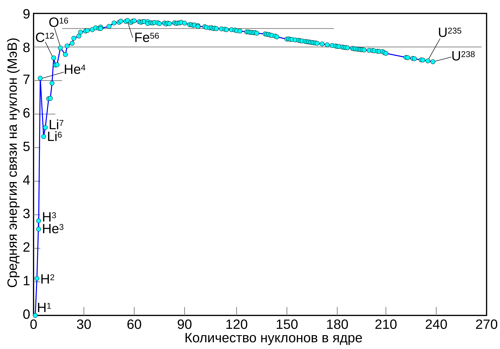
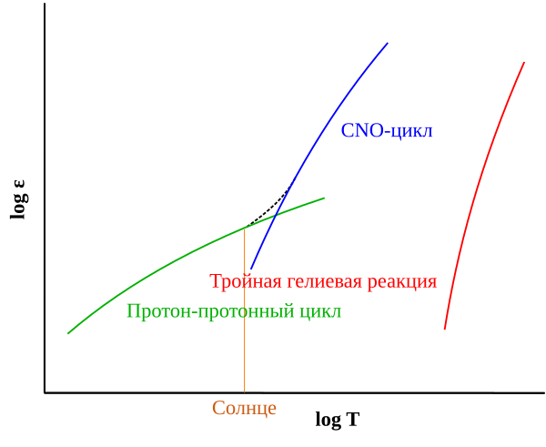
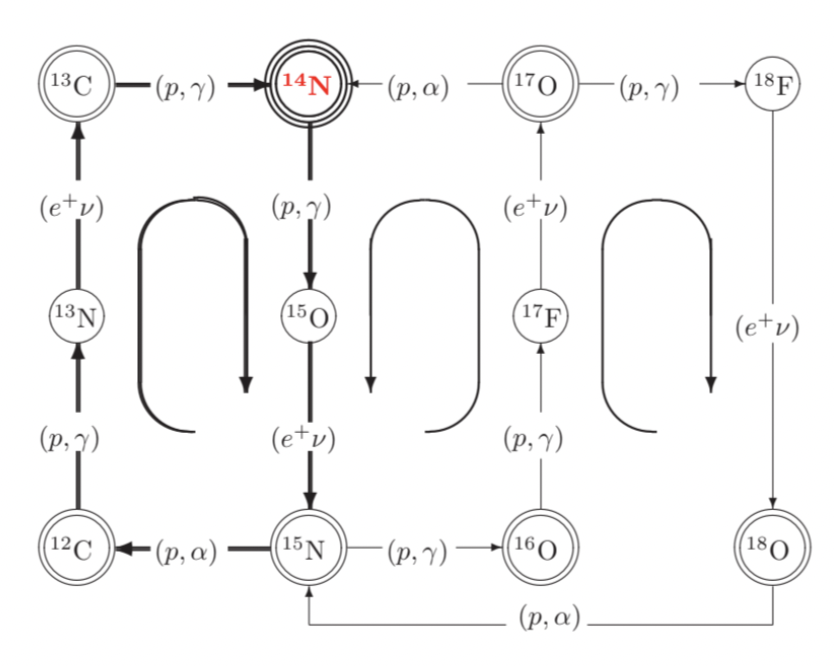
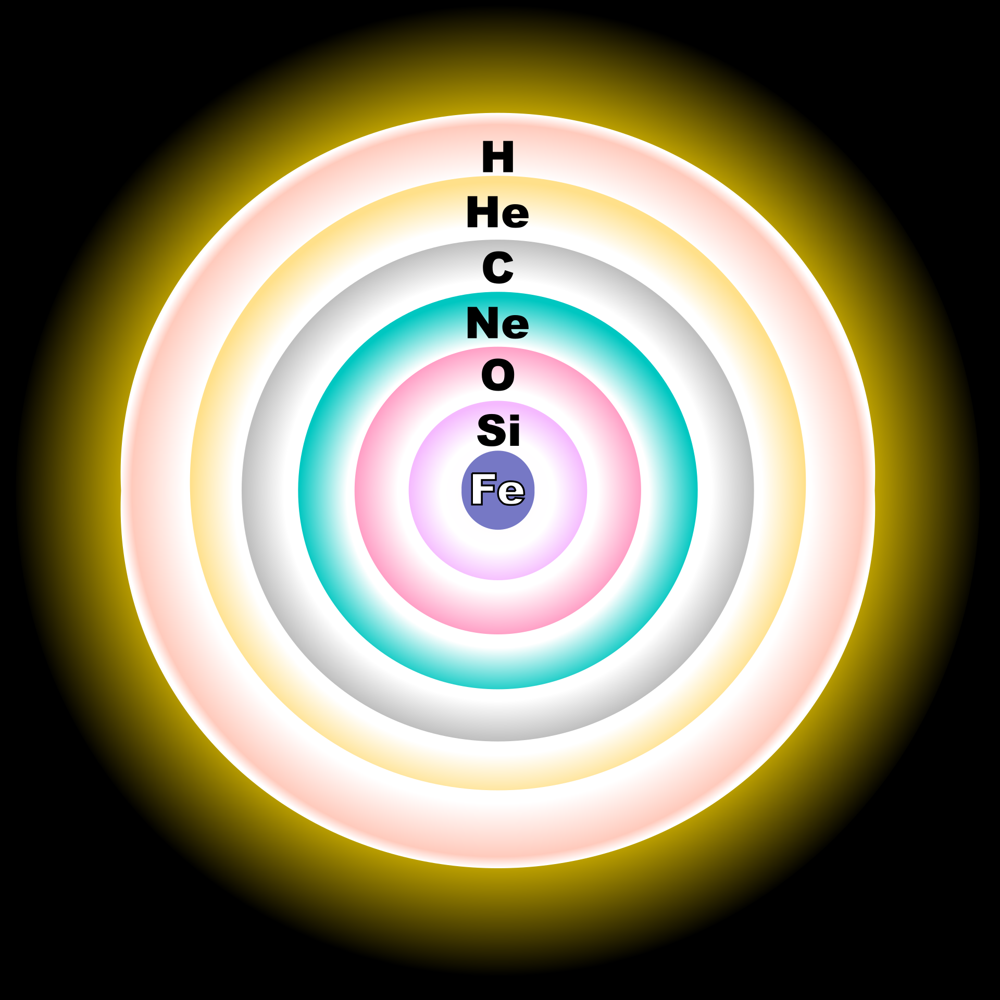

## 1. Общие принципы

Главным источником энергии в обычных (находящихся на Г.П./ветвях гигантов) звёздах являются реакции термоядерного синтеза, в результе которых два атома объеденяются в один с выделением энергии.

Здесь сразу полезно обозначить, что если, например, при превращении $4$ протонов в гелий выделяется энергия, то если мы захотим запустить обратную реакцию, то нам уже нужно будет самим добавлять энергию. Однако, как вы наверное знаете для элементов после "железного пика" энергия выделяется именно при распаде, а чтобы соеденить два элемента нужно наоборот добавлять энергию.

Ключевым отличием элементов до железа и после является то, что до него удельная масса ядер (масса на один нуклон) уменьшается с увеличением массы, а после него обратно растёт.

Именно эта ключевая особенность по сути и позволила звёздам светить именно за счёт термоядерного синтеза, и именно по этому элементов до железа во вселенной сильно больше, чем после (элементы после железа могут образовываться только при экстремально высоких темпераутрах, например во время гравитационных коллапсов).

Интересно, что термоядерный синтез в звёздах возможен только благодаря квантовым эффектам. Действительно, характерная температура внутри в ядрах звёзд типа Солнца:

$$
T_0 \approx 15 \cdot 10^6 \text{ К}
$$

Оценим характерную тепловую энергию частиц:

$$
\epsilon = kT \approx 1 \text{ КэВ}
$$

С другой стороны чтобы два протона столкнулись (чтобы образовать дейтерий) им нужно преодолеть кулоновский барьер (сила электромагнитного взаимодействия их отталкивает, поэтому нужно кинетическую энергию потратить на преодоление работы):

$$
\Delta U = \frac{e^2}{4\pi\epsilon_0 r}
$$

Здесь $r \approx 10^{-15}$м -- характерное расстояние, на которое должны сблизиться протоны, чтобы запустить реакцию. Получаем:

$$
\Delta U \approx 1.5 \text{ МэВ}
$$

Доля частиц, летящих с кинетической энергией большей $\Delta U$ пропорциональна $exp(\Delta U/kT) \approx 10^{-430}$, что, казалось бы делает невозможным протекание такой реакции. Однако именно за счёт эффектов квантового туннелирования такие реакции протекают в ядрах звёзд.

Энергия, которая выделяется в одной реакции может быть посчитана просто из закона сохранения энергии. Как мы видим, кинетическая (тепловая) энергия частиц в звёздных ядрах как правило значительно меньше не только их энергий покоя, но и деффекта масс (в энергетическом эквиваленте). Поэтому в звёздных ядраз практически всегда можно пренебрегать кинетической энергией частиц. Также обычно можно пренебречь и энергией побочных продуктов, например нейтрино. Тогда на выделяющуюся в реакции энергию влияет только разность энергий покоя:

::: {.formula title="Энергия одной реакции"}
$$
\epsilon = \Delta m \cdot c^2
$$
:::

Здесь $c$ -- скорость света, а $\Delta m$ -- дефект масс, по сути разность масс покоя частиц до реакции и после. В общем случае же необходимо учитывать также разность кинетических энергий до и после реакции.

## 2. Горение водорода

Почти всю жизнь звезды в ней горит водород, превращаясь в гелий. Большую часть жизни звезды (порядка $90\%$) она находится на главной последовательности. Этот период в жизни звезды выделяется прежде всего тем, что основным источником энергии в звезде является горение водорода именно в ядре.

Звезда сходит с главной последовательности, когда сжигает примерно половину от водорода в ядре. При этом неверно было бы думать, что масса звезды из-за этого значительно уменьшается. Как мы помним почти весь водород превращается в гелий, и лишь малая часть от массы (порядка $0.7\%$) уходит в энергию. После схода с Г.П. водород продолжает гореть уже в слоевом источнике.

Оценим энергию, которая выделяется в результате превращения. Вообще говоря, она зависит от того, какая именно реакция идёт (pp цикл или CNO цикл), потому что побочные продукты реакций (например нейтрино, позитроны и т.д.) могут отличаться. Однако их вклад в массу очень мал даже по сравнению с выделяющейся энергией. Поэтому для оценки можем использовать просто:

$$
\epsilon
=
\Delta m c^2
=
(M_{\mathrm{He}}-4m_p)c^2
\approx26\ \mathrm{МэВ}
$$

Итак, водород горит в звезде в двух реакциях: протон-протонный цикл и CNO цикл. Обсудим их подробнее:

1. Начнём с pp цикла. На самом деле существуют аж $3$ различных цепочки превращения $4p$ в гелий (без посредников, как в CNO). Наиболее важная для нас -- цепочка pp I, поскольку именно в ней вырабатывается большая часть энергии в pp цикле:

$$
^{1}_{1}\mathrm{H}
+
^{1}_{1}\mathrm{H}
\longrightarrow
^{2}_{1}\mathrm{D}
+
e^+
+
\nu_e
$$

$$
^{2}_{1}\mathrm{D}
+
^{1}_{1}\mathrm{H}
\longrightarrow
^{3}_{2}\mathrm{He}
+
\gamma
$$

$$
{}^{3}_{2}\mathrm{He}
+
{}^{3}_{2}\mathrm{He}
\longrightarrow
{}^{4}_{2}\mathrm{He}
+
2\,{}^{1}_{1}\mathrm{H}
$$

Основное время в цепочке занимает именно первая реакция, поэтому именно ей определяется темп энерговыделения. В цепочках pp II и III первые две реакции такие же, однако дальше происходит образование лития/бора/бериллия и их последующий распад.

В итоге основную цепочку можно записать следующим образом:

::: {.formula title="p-p цикл"}
$$
4\,{}^{1}_{1}\mathrm{H}
\longrightarrow
{}^{4}_{2}\mathrm{He}
+
2e^+
+
2\nu_e
+
2\gamma, \ \ \
\mathrm{Q = МэВ}
$$
:::

При этом, так как газ ионизирован, $\mathrm{H}$ тоже самое, что и просто протон. Отдельно отметим, что в одной реакции появляются два нейтрино. Исходя из этого можем оценить поток нейтрино у Земли. Оценим число реакций, происходящих в секунду в Солнце:

$$
N=
\frac{L}{\epsilon}
\approx
9.3\cdot10^{37}
$$

Тогда поток нейтрино на орбите Земли будет равен:

$$
F=
\frac{2N}{4\pi r_E^2}
=
7\cdot10^{14}
\ \mathrm{м^{-2}\,с^{-1}}
$$

2. При увеличении массы и температуры в звёздах реакциями, в которых вырабатывается основная часть энергии постепенно становятся цепочки из CNO цикла (в звёздах с $M>1.2M_\odot$). По сути в этих реакциях опять же происходит превращение водорода в гелий (с примерно тем же энерговыделением), однако теперь в реакциях задействованы углерод, азот и кислород.

На графике изображена зависимость мощности энерговыделения от температуры для различных реакций: pp-цикла (зелёный), CNO-цикла (синий) и тройного альфа-процесса (красный, превращение гелия в углерод).

CNO цикл -- совокупность трёх частично перекрываемых друг-другом циклов. Общий принцип работы прост. К углероду/азоту постепенно присоединяются протоны, создаётся азот/кислород, который потом обратно распадается на альфа-частицу и углерод/азот. В результате 4 протона образуют гелий.

Энерговыделение в цикле CNO чуть меньше, чем в pp, так как нейтрино уносят большую энергию. Средний энерговыход CNO цикла можно принять равным $25$ МэВ. При этом в одной конкретной цепочке реакций также выделяется два нейтрино.

## 3. Горение гелия

После того, как звезда сходит с главной последовательности, а горение водорода постепенно переходит из ядра в слоевой источник, ядро, на время потеряв источник энергии, сжимается и увеличивает температуру. При достижении температуры в $20-30$ миллионов кельвинов в ядре запускается горение гелия.

Основной реакцией горения гелия является тройной альфа-процесс, в котором по сути три альфа-частицы превращаются в углерод. Однако сразу можем отметить, что вероятность того, что в ядре столкнутся $3$ частицы крайне мала. Поэтому данный процесс идёт в два этапа. Сначала два ядра гелия сталкиваются и образуют короткоживущее ядро бериллия, а потом это ядро бериллия сталкивается ещё с одной альфа-частицей, образуя уже возбуждённое ядро углерода (возбуждение снимается рождением пары электрон-позитрон).

$$
{}^{4}_{2}\mathrm{He}
+
{}^{4}_{2}\mathrm{He}
\longrightarrow
{}^{8}_{4}\mathrm{Be}
$$

$$
{}^{8}_{4}\mathrm{Be}
+
{}^{4}_{2}\mathrm{He}
\longrightarrow
{}^{12}_{6}\mathrm{C}^{*}
$$

$$
{}^{12}_{6}\mathrm{C}^{*}
\longrightarrow
{}^{12}_{6}\mathrm{C}
+
e^-
+
e^+
$$

Заметим, что не все ядра бериллия, образованные в первой реакции, переходят во вторую. Огромная часть из них распадается обратно на $2$ альфа-частицы, и лишь малая часть успевает столкнуться с гелием. Аналогичная ситуация с возбуждённым ядром углерода из второй реакции. Большинство из них распадаются на $3$ альфа-частицы, так и не успев прийти в стабильное состояние, однако маленькая часть из них всё же успевает. Так как для реакции по сути необходимы $3$ частицы, очень важно, чтобы плотность в ядре была достаточно большой.

Итоговое энерговыделение в одной реакции составляет:

$$
\epsilon
=
\Delta m c^2
=
(M_{\mathrm{C}}-3M_{\mathrm{He}})c^2
\approx
7.3\ \mathrm{МэВ}
$$

В реальности $\epsilon$ чуть больше, примерно $7.7\ \mathrm{МэВ}$.

В случае, если ядро на момент горения гелия было сильно вырожденным, то давление создаётся почти полностью электронным газом, а выделяющаяся энергия ведёт к увеличению температуры невырожденного газа, и, как следствие, лавинообразному нарастанию скорости выделения энергии. Это происходит, пока температура не становится достаточной для того, чтобы снять вырождение. После этого, в соответствии с теоремой вириала, ядро расширяется и охлаждается.

Описанный процесс называется гелиевой вспышкой и происходит после схода с главной последовательности, в момент, когда звезда уже является гигантом. Она происходит лишь у звёзд небольших масс:

$$
M < 2-2.5M_\odot
$$

При этом:

$$
M>0.5M_\odot
$$

необходимо, чтобы ядро вообще было способно поддерживать температуру и плотность, необходимые для горения гелия.

После образования достаточного количества ядер углерода в звезде также начинаются реакции выгорания углерода с образованием кислорода, а после его накопления — неона:

$$
{}^{12}_{6}\mathrm{C}
+
{}^{4}_{2}\mathrm{He}
\longrightarrow
{}^{16}_{8}\mathrm{O}
+
\gamma, \ \ \ 
\mathrm{Q=7.2 МэВ}
$$

$$
{}^{16}_{8}\mathrm{O}
+
{}^{4}_{2}\mathrm{He}
\longrightarrow
{}^{20}_{10}\mathrm{Ne}
+
\gamma, \ \ \ 
\mathrm{Q=4.7 МэВ}
$$

Отдельно заметим, что чем более поздние элементы в таблице Менделеева мы рассматриваем, тем большая для их синтеза нужна температура и плотность в звезде. Поэтому чем изначально массивнее была звезда, тем больше элементов она сможет насинтезировать. Некоторые звёзды не дойдут даже до горения гелия, а самые большие смогут обеспечить условия для горения кремния и образования, например, железа.

## 4. Горение углерода и неона

Итак, для звёзд с массой порядка $8\,M_\odot$ горение элементов заканчивается на кислороде и неоне. Однако при больших массах запускаются следующие реакции. В углеродно-кислородном ядре сначала запускается реакция горения углерода (как имеющая наименьший кулоновский барьер из остальных реакций с участием углерода и кислорода) с образованием нестабильного ядра магния:

$$
{}^{12}_{6}\mathrm{C}
+
{}^{12}_{6}\mathrm{C}
\longrightarrow
{}^{24}_{12}\mathrm{Mg}^{*}
$$

После чего это ядро может распасться на, например, Ne и $\alpha$-частицу, или Na и протон, или Mg с нейтроном или фотоном. Как раз за счёт этой реакции в звезде образуются натрий и магний. В результате большая часть углерода выгорает в неон. После завершения горения углерода ядро опять же поджимается в отсутствии источника энергии (и теряя энергию из-за нейтрино). В результате ядро снова нагревается, и при массе звезды:

$$
M>10\,M_\odot
$$

достигает температуры порядка $1.2-1.5$ миллиардов кельвинов. В звёздах же меньшей массы горение углерода оказывается последним этапом.

При достижении в ядре достаточной температуры и плотности запускается двуступенчатое горение неона. На первом этапе происходит так называемая фотодезинтеграция ядер (по сути распад ядра с помощью фотона):

$$
\gamma
+
{}^{20}_{10}\mathrm{Ne}
\longrightarrow
{}^{16}_{8}\mathrm{O}
+
{}^{4}_{2}\mathrm{He}, \ \ \  
\mathrm{Q= - 4.7 МэВ}
$$

После чего на втором этапе высвободившееся ядро гелия также взаимодействует:

$$
{}^{20}_{10}\mathrm{Ne}
+
{}^{4}_{2}\mathrm{He}
\longrightarrow
{}^{24}_{12}\mathrm{Mg}
+
\gamma, \ \ \  
\mathrm{Q=9.3 МэВ}
$$

В итоге можем записать:

$$
{}^{20}_{10}\mathrm{Ne}
+
{}^{20}_{10}\mathrm{Ne}
\longrightarrow
{}^{16}_{8}\mathrm{O}
+
{}^{24}_{12}\mathrm{Mg}
+
\gamma, \ \ \  
\mathrm{Q=4.6 МэВ}
$$

## 5. Горение кислорода и кремния

В результате выгорания неона в ядре оно становится почти полностью кислородным. Опять же, темп энерговыделения падает, ядро поджимается, нагревается. Температура в ядре на данном этапе достигает примерно двух миллиардов кельвинов. В итоге запускается горение кислорода с итоговым образованием кремния (промежуточные реакции мы опустим):

$$
{}^{16}_{8}\mathrm{O}
+
{}^{16}_{8}\mathrm{O}
\longrightarrow
{}^{28}_{14}\mathrm{Si}
+
{}^{4}_{2}\mathrm{He}, \ \ \  
\mathrm{Q=17.2 МэВ}
$$

В ядре начинает накапливаться кремний и сера (синтезируется в промежуточных реакциях), а после ещё одного сжатия ядра и повышения температуры начинает гореть кремний. Это последний этап эволюции массивных звёзд, здесь ещё продолжают гореть только очень массивные звёзды ($M > 10-11\,M_\odot$). Итоговую реакцию горения кремния в железо можно представить так:

$$
{}^{28}_{14}\mathrm{Si}
+
{}^{28}_{14}\mathrm{Si}
\longrightarrow
{}^{56}_{26}\mathrm{Fe}
+
Q
$$

Температура, характерная для данного этапа составляет порядка $3$ миллиардов кельвинов. Для таких звёзд картина их химического состава в конце их эволюции выглядит примерно следующим образом:

